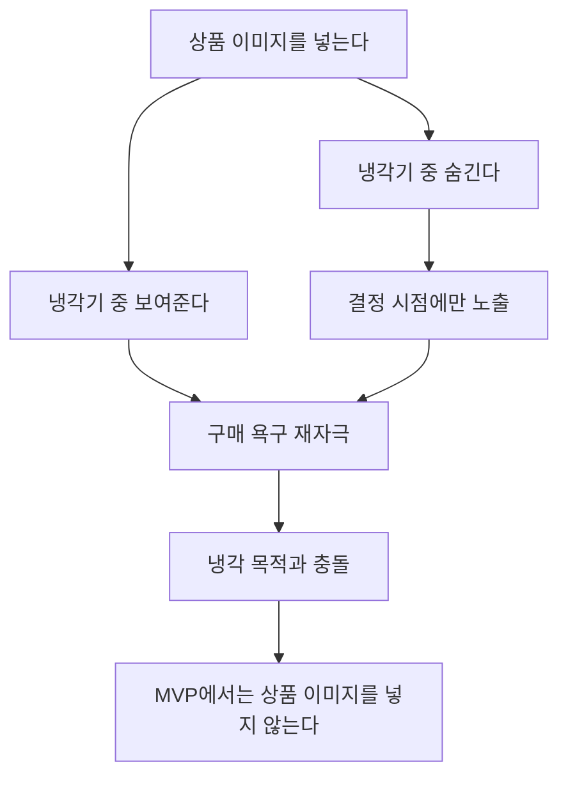

# ADR — 상품 이미지를 넣지 않는다 (방법 불문)

> 아카이브 문서입니다. 현재 제품 스펙은 `docs/pm/prd.md`와 `docs/design/screen-spec.md`를 우선합니다.

## 1. 맥락

상품 등록 시 사진을 넣을지 말지 고민이 있었다. 직접 업로드, OG 태그 자동 추출 등 방법을 검토했으나, **방법이 아니라 "이미지가 이 서비스에 필요한가" 자체가 핵심 질문**이다.

## 2. 결정

**상품 이미지를 넣지 않는다. 직접 업로드든 OG 추출이든 방법 불문.**

## 3. 근거

### 3-1. 이 서비스는 쇼핑 서비스가 아니다

쇼핑 서비스는 물건을 매력적으로 보여줘서 사게 만든다. 쿨링오프는 반대다. 서비스의 목적은 wanting을 식히고 객관적으로 판단하게 하는 것인데, 상품 이미지는 wanting을 가장 강하게 자극하는 요소다.

### 3-2. 냉각기 중 정보 숨김 원칙과 충돌

PRD 원칙: 냉각 중에는 항목 이름, 남은 시간, 결정 가능 시점만 보여주고, 가격, URL, 사고 싶은 이유, 이미지는 보여주지 않는다. 이유는 다시 보면 wanting이 되살아날 수 있기 때문이다.

이미지가 있으면 두 가지 모순이 생긴다:
- 냉각기 중에 이미지를 **보여주면** → 원칙 위반. 이미지는 텍스트보다 감정 자극이 훨씬 강해서 냉각 효과가 약해짐.
- 냉각기 중에 이미지를 **숨기면** → 넣은 의미가 없음. 결정 시점에만 보이는 건데, 그때 보여주면 wanting이 되살아나서 역효과.

어느 쪽이든 이미지는 서비스의 핵심 메커니즘(냉각)을 약화시킨다.

### 3-3. AI 대화에 이미지가 필요 없다

AI 대화 시뮬레이션 2개(에어팟 프로3, 러닝화)를 돌렸다. 둘 다 텍스트(상품명 + 가격 + 등록 사유)만으로:
- 정보 수집 → 관점 제시 → 자각까지 전체 대화가 성립
- AI가 "35만원어치 귀찮음" 체감 비용 계산, "배터리 교체 7~8만원" 대안 제시 등 모두 텍스트 기반

이미지가 없어서 대화가 약해지는 경우는 없었다. 상세: `../engineering/ai-simulation-log.md`

### 3-4. 등록 마찰 증가

갤러리에서 사진을 찾거나 이미지를 확인하는 과정은 등록 부담을 키운다. 쿨링오프의 등록은 구매 직전의 높은 욕구 상태에서 일어나므로, 입력 부담이 커지면 사용자가 등록 자체를 포기할 수 있다.

### 3-5. 경쟁 서비스도 안 넣는다

| 서비스 | 상품 이미지 | 비고 |
|---|:---:|---|
| CutCut | ❌ | 가장 직접적인 경쟁자. 이미지 없이 결정 저널만 |
| Icebox | ❌ | 텍스트 기반 |
| SpendShield | ✅ | 사진 기반이지만 리뷰 1건. 검증 안 됨 |
| Mindful Spend | ❌ | 텍스트 기반 웹 서비스 |

이미지를 넣은 SpendShield만 사용자가 거의 없고, 이미지 없는 CutCut이 활발하다.

## 4. 기각된 대안

| 대안 | 기각 이유 |
|------|----------|
| 직접 업로드 | 등록 부담 증가 + 이미지 저장 정책 추가 필요 |
| URL에서 OG 태그 자동 추출 | 한국 쇼핑몰 OG 메타가 불안정 (쿠팡은 되지만 네이버쇼핑/무신사 등은 CDN 차단). URL이 선택 필드라 분기 발생. 근데 핵심은 **방법이 아니라 이미지 자체가 불필요하다는 것** |
| 냉각기 끝난 후에만 이미지 표시 | 결정 시점에 이미지를 보면 wanting이 되살아남. 냉각기의 목적(감정을 식히기)과 충돌 |

## 5. 재검토 조건

이 결정을 뒤집을 수 있는 근거:
- 사용자 테스트에서 "뭘 등록했는지 기억이 안 나서 서비스를 안 쓰게 됐다"는 피드백이 반복되는 경우
- 이미지가 있을 때와 없을 때 대화 품질/결정 품질에 유의미한 차이가 있다는 A/B 테스트 결과

현재는 이런 근거가 없으므로 이미지를 넣지 않는다.
