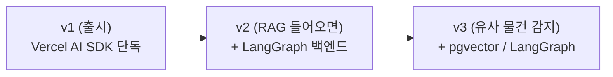

# ADR: AI 통합 라이브러리로 Vercel AI SDK 채택

## TL;DR

v1 AI 통합은 Vercel AI SDK 단독으로 한다. 벤더 SDK 직접 호출이나 LangChain.js 같은 풀 프레임워크는 채택하지 않는다.

이유: 모델·프롬프트가 바뀔 수 있는 단계에서 추상화 없이 가면 교체 비용이 크다.

RAG·에이전트 같은 다단계 워크플로우가 들어오는 시점(v2)에 LangGraph 백엔드 추가를 재평가한다.

---

## 1. 맥락 — 왜 이 결정이 필요한가

쿨링오프 v1 AI 채팅은 [`model-selection.md`](../engineering/model-selection.md)에서 모델을 Gemini 3.1 Flash-Lite로 확정했지만, 어떤 라이브러리로 호출할지는 정해진 게 없다.

모델과 프롬프트는 출시 후에도 바뀔 수 있다. 그 단계에서 벤더 SDK를 직접 호출하면, 모델 교체마다 SDK·메시지 포맷·캐싱 API를 통째로 다시 깔아야 한다. 비용도 들고 확장 여지도 좁다.

추상화 레이어를 한 겹 두면 교체가 환경변수 한 줄로 끝난다. 다른 모델로 옮기거나 새 시나리오를 붙일 때도 손이 덜 간다. 어떤 레이어로 갈지를 이 ADR에서 정한다.

## 2. 결정 기준 (Decision Drivers)

우선순위 순.

1. **비개발자 마이그레이션 가능성** — 모델·라이브러리 교체를 비개발자가 풀 수 있는가
2. **Next.js 통합 마찰** — Route Handler / Server Action / Edge Runtime 호환
3. **학습 자료 풍부도** — Claude·Cursor 같은 AI가 모범 사례를 보고 코드 생성할 수 있는가
4. **운영비·번들 크기** — 100~1000 MAU 규모에서 무시할 수준인가

## 3. 검토한 옵션

| 옵션 | 정체 | 채택 |
|---|---|:---:|
| A. 벤더 SDK 직접 호출 | `@google/genai` 또는 fetch로 REST 직접 | ❌ |
| **B. Vercel AI SDK** | npm `ai` + 프로바이더 어댑터 | ✅ |
| C. LangChain.js | 풀 프레임워크 (체인·에이전트·RAG) | ❌ |
| D. 게이트웨이 (OpenRouter / LiteLLM / Portkey) | HTTP 프록시 레이어 | ❌ (v1 시점) |

## 4. 옵션 평가

| 기준 | A. 벤더 직접 | B. AI SDK | C. LangChain.js | D. 게이트웨이 |
|---|---|---|---|---|
| 비개발자 마이그레이션 | ❌ SDK 통째 교체 | ✅ `model:` 한 줄 교체 | ⚠️ 추상화 학습 비개발자에 전가 | △ 인프라 추가 필요 |
| Next.js 통합 | △ Route Handler 수동 | ✅ App Router·Server Action·Edge 1급 시민 | ❌ Edge Runtime 미호환 (Node `fs` 의존) | △ 무관 |
| 학습 자료 | ✅ 벤더 공식 문서 풍부 | ✅ 카테고리 1위, weekly 13.1M downloads | ⚠️ breaking change 잦아 AI가 deprecated API 생성 위험 | △ 한정적 |
| 운영비·번들 | ✅ 최소 | ✅ 가벼움 | ❌ 101 kB gzipped | △ 게이트웨이 수수료/인프라 |
| 한 줄 요약 | "지금은 쉽지만 나중에 못 바꿈" | "위 4개 다 통과" | "지금도 무겁고 나중에도 부담" | "v1엔 불필요한 인프라" |

## 5. 결정

**B. Vercel AI SDK 단독 채택.**

이 옵션이 결정 기준 1·2·3을 모두 만족하는 유일한 선택지다. 운영비·번들도 가장 가볍다.

구체 패키지: `ai` + `@ai-sdk/google` + `@ai-sdk/react` (3개).

## 6. 결과 (Consequences)

### 긍정

- 모델 교체가 환경변수(`LLM_MODEL`) 한 줄로 끝난다. 비개발자가 직접 할 수 있음.
- 클라이언트 채팅 UI는 `useChat()` hook 한 줄. 메시지 state·스트리밍은 hook이 알아서.
- `model-selection.md` §5의 "Haiku 4.5 마이그레이션 1~2시간" 추정이 지킬 수 있는 수준이 된다.

### 부정

- RAG/에이전트 같은 멀티 step 워크플로우가 들어올 때 LangGraph 등 별도 추상화 추가 필요. 처음부터 LangChain을 깔았다면 그 단계에서 한 번에 갈 수 있었음.
- Vercel/Next.js 생태계에 약하게 락인. 다만 AI SDK는 Apache 2.0이라 fork 가능.

### 후속 작업

- [`tech-spec.md`](../engineering/tech-spec.md) §1·§5에 라이브러리·환경변수 분리 가이드 명시 (같은 PR에서 처리).
- 시스템 프롬프트를 별도 파일(`prompts/system.md`)로 분리. 프로바이더 교체와 무관하게 재사용.
- 메타 태그 후처리는 [`ai-prompt-v1.md`](../engineering/ai-prompt-v1.md) §8의 서버 사이드 후처리 그대로 적용.

## 7. 재검토 트리거

이 결정을 다시 봐야 할 신호.

| 트리거 | 재검토 대상 | 다음 액션 |
|---|---|---|
| v2: PRD §6 "MVP에서는 사용자의 과거 결정 기록을 AI 채팅의 근거로 사용하지 않습니다"가 풀려 과거 기록 RAG 도입 | C. LangChain.js (LangGraph 백엔드) | 백엔드에 LangGraph 추가, 프론트 `useChat`은 유지 |
| v2: PRD §10 #4 (유사 물건 반복 등록) 해결을 위해 임베딩 검색 도입 | pgvector + AI SDK `embed()` (단순) 또는 LangGraph (복잡) | 단계 3개 이상이면 LangGraph 검토 |
| 운영 중 한국어 톤 이슈 | 모델 교체 (Haiku 4.5) — 라이브러리 결정과 무관 | `model-selection.md` §5의 마이그레이션 흐름 그대로 |
| 운영 중 다중 모델 라우팅·예산 거버넌스 필요 | D. 게이트웨이 도입 검토 | OpenRouter (호스팅) 또는 Portkey (셀프호스트) 비교 |

## 8. 진화 경로



원칙은 **"지금 가볍게, 필요해질 때 추가"**. 무거운 추상화를 미리 들고 가지 않는다.

## 9. 검증 (1차 데이터)

"AI SDK가 표준"이라는 단정의 근거.

### npm weekly downloads (2026-05-17 KST, npm 공식 API)

| 패키지 | weekly | 카테고리 |
|---|---:|---|
| `openai` (벤더 직접) | 21.5M | 벤더 SDK |
| `@anthropic-ai/sdk` (벤더 직접) | 17.8M | 벤더 SDK |
| **`ai`** (Vercel AI SDK) | **13.1M** | 통합 라이브러리 |
| `@google/genai` (벤더 직접) | 10.9M | 벤더 SDK |
| `@langchain/core` | 4.4M | 프레임워크 |
| `langchain` | 2.15M | 프레임워크 |

### GitHub stars (GitHub API)

- `vercel/ai`: 24.3K
- `langchain-ai/langchainjs`: 17.7K
- `mastra-ai/mastra`: 23.9K (LangChain.js 추월, 참고용)

### 해석

- **벤더 SDK 직접 호출이 시장 1위.** 추상화 없이 그냥 호출하는 사람이 가장 많다.
- **추상화 라이브러리 카테고리에서는 Vercel AI SDK가 단연 1위** — LangChain.js의 약 6배.

### 결정적 단서

**LangChain.js 공식 Next.js 템플릿조차 streaming은 Vercel AI SDK(`import { createTextStreamResponse } from "ai"`)에 의존한다.** LangChain.js 단독으로 Next.js 챗봇을 완결시키기 어렵다는 뜻.

## 10. 기각 옵션 상세

### A. 벤더 SDK 직접 호출 (`@google/genai`)

**기각 이유**: 모델 교체 시 SDK 자체를 바꿔야 하고, 비개발자가 메시지 포맷·시스템 프롬프트·캐싱 API 차이를 정리하기 어렵다. `model-selection.md` §5의 "1~2시간 마이그레이션" 추정이 무너진다.

### C. LangChain.js (풀 프레임워크)

기각 이유 세 가지.

1. **추상화 비용이 이득을 초과.** v1 챗봇은 "시스템 프롬프트 → 멀티턴 → 마무리 발화" 한 줄 흐름. LangChain의 강점(체인·에이전트·RAG)은 여러 단계가 엮일 때 빛난다.
2. **Edge Runtime 미호환.** Node `fs` 의존이라 Next.js Edge 옵션이 닫힌다.
3. **PRD §3 원칙 7과 방향 반대.** AI를 "외부 관찰자"로 강하게 제한했는데, LangChain의 강점은 자율 도구 호출·복잡 추론. 제품 정체성과 어긋난다.

→ v2에서 RAG가 들어오면 백엔드에 **LangGraph**(LangChain.js의 워크플로우 서브셋)를 추가하는 형태로 재검토.

### D. 게이트웨이 (OpenRouter / LiteLLM / Portkey)

**v1 시점 기각 이유**: 100~1000 MAU 규모에서 단일 벤더 API 키 직접 사용으로 충분. 멀티 모델 라우팅·예산 거버넌스·가드레일이 실제 필요해지는 시점(예: 사용자 폭증, 다중 키 분배)에 도입해도 늦지 않다.

---

## 부록 A. 시장 지형 (라이브러리 vs 게이트웨이)

```
멀티 LLM 통합
├── 1. 라이브러리 (코드에 import)
│   ├── A. 통합 호출 라이브러리      ← Vercel AI SDK ✅ 채택
│   ├── B. 에이전트/체인 프레임워크   ← LangChain.js, Mastra, Genkit
│   └── C. RAG/데이터 프레임워크     ← LlamaIndex.TS
└── 2. 게이트웨이 (HTTP 프록시)
    ├── D. 호스팅 게이트웨이         ← OpenRouter
    ├── E. 셀프호스트 프록시        ← LiteLLM, Portkey
    └── F. 관측 중심 프록시         ← Helicone
```

라이브러리와 게이트웨이는 보완 관계. 예: Vercel AI SDK 안에서 OpenRouter URL 호출 (`@openrouter/ai-sdk-provider` weekly 80만).

## 부록 B. 출처

- [AI SDK 공식 — Introduction](https://ai-sdk.dev/docs/introduction) — Core/UI 구성, streamText·useChat 기본 사용법
- [LangChain Next.js Template](https://github.com/langchain-ai/langchain-nextjs-template) — 공식 템플릿이 AI SDK 의존하는 코드 확인 지점
- [LangChain vs Vercel AI SDK: 2026 Guide — Strapi](https://strapi.io/blog/langchain-vs-vercel-ai-sdk-vs-openai-sdk-comparison-guide) — 공수·번들·Edge 호환 비교
- [LangChain Is Quietly Losing Developers — Roborhythms](https://www.roborhythms.com/langchain-losing-developers-2026/) — 추상화 오버헤드·breaking change 비판
- [Top JS/TS GenAI Frameworks 2026 — DZone](https://dzone.com/articles/top-js-ts-genai-frameworks-2026) — Mastra·Genkit 포함 카테고리 정리
- [Portkey vs LiteLLM vs OpenRouter 2026 — PkgPulse](https://www.pkgpulse.com/guides/portkey-vs-litellm-vs-openrouter-llm-gateway-2026) — 게이트웨이 비교
- npm downloads API · GitHub API — 1차 데이터 (2026-05-17 KST 직접 호출)
