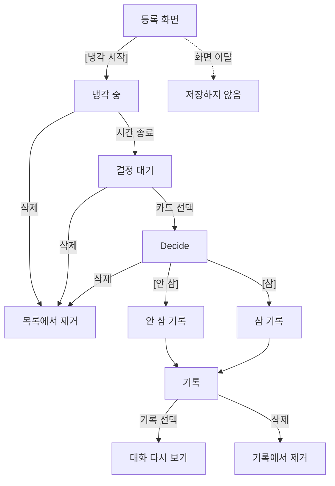
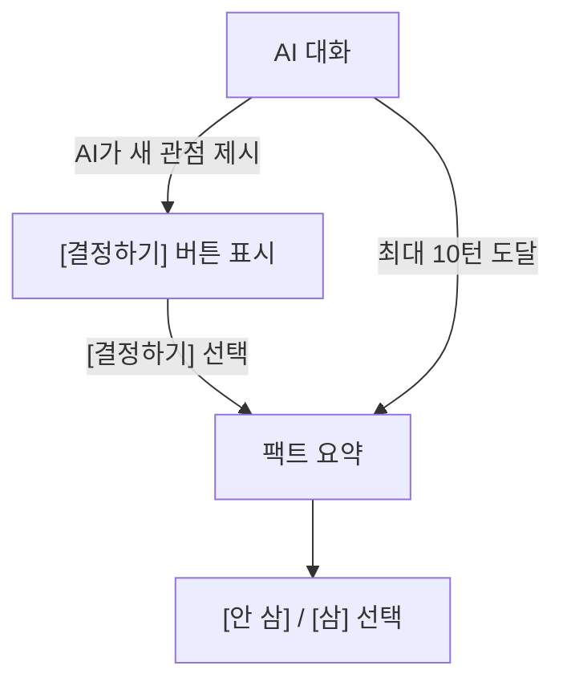

# 쿨링오프 화면 정책

> 화면별 표시 기준, 사용자 행동, 입력 검증, 오류 처리를 정의하는 문서.
>
> **관련 문서:**
> - 요구사항: [`../pm/prd.md`](../pm/prd.md)
> - AI 프롬프트: [`../engineering/ai-prompt-v1.md`](../engineering/ai-prompt-v1.md)

---

## 0. 변경 이력

### v1.4 (2026-05-01, PRD 정합성 수정)

| 변경 | 왜 바꿨는지 |
|------|-------------|
| 냉각 중 화면에서 가격·URL·사고 싶은 이유를 표시하지 않도록 수정 | 구매 욕구 재자극을 줄이는 PRD 원칙과 FR-3을 맞추기 위해 |
| 등록 폼을 4필드(이름/가격/URL/사고 싶은 이유)로 수정 | PRD의 단일 폼 요구사항과 실제 입력 정보를 일치시키기 위해 |
| 결정 대기 상태를 명시 | 냉각기 만료 후 사용자가 직접 [삼]/[안 삼]을 선택할 수 있게 하기 위해 |
| 삭제 정책 정리 | 사용자가 냉각 중 항목, 결정 대기 항목, 완료 기록을 직접 정리할 수 있게 하기 위해 |
| 기록 화면에 결정 개수 + 월별 묶음을 추가 | PRD의 "결정의 궤적" 정의를 화면 스펙에 반영하기 위해 |
| About 페이지에 데이터 저장 정책과 쇼핑중독 면책을 추가 | PRD가 요구하는 주의 문구를 누락 없이 명시하기 위해 |
| AI 시작 메시지를 고정 첫 메시지로 수정 | PRD의 "항상 같은 질문으로 시작" 규칙과 Decide 예시를 맞추기 위해 |

## 1. 상태 정책

### 1-1. 물건 흐름

사용자가 등록한 물건은 아래 흐름을 따른다. AI 대화, [결정하기] 버튼, 팩트 요약은 물건 상태가 아니라 Decide 화면 안에서만 쓰는 진행 흐름이다.



#### 흐름 보충 기준

- 등록 화면을 나가면 저장하지 않는다.
- 냉각 중에는 항목 이름, 남은 시간, 결정 가능 시점만 표시한다. 가격, URL, 사고 싶은 이유, 이미지는 표시하지 않는다.
- 냉각 중 항목과 결정 대기 항목을 삭제하면 홈 목록에서 사라지고 기록에는 남지 않는다.
- 결정 대기 항목은 사용자가 [삼] 또는 [안 삼]을 선택할 때까지 유지한다.
- 완료된 기록을 삭제하면 기록 목록, 결정 개수, 당시 대화, 팩트 요약에서 제거한다.

### 1-2. Decide 화면 흐름



**핵심 결정:**

- 냉각 중 상태에서는 항목 이름, 남은 시간, 결정 가능 시점만 표시한다. 가격, URL, 사고 싶은 이유, 이미지는 표시하지 않는다.
- 냉각 중 항목과 결정 대기 항목은 삭제 가능. 삭제하면 홈 목록에서 사라지고 기록에는 남지 않음.
- 결정 대기 상태는 사용자가 [삼] 또는 [안 삼]을 선택할 때까지 유지.
- 완료된 결정 기록도 삭제 가능. 삭제하면 기록 목록, 당시 대화, 팩트 요약을 더 이상 표시하지 않음.
- **[결정하기] 버튼은 AI가 관점을 제시한 이후에만 노출** — AI가 관점을 제시하기 전에는 결정 불가.
- **대화와 결정 버튼이 같은 화면에 공존** — 별도 화면 전환 없음.

### 1-3. 로그인 접근 정책

MVP는 최소 로그인 방식 1개를 제공한다. 구체 구현 방식은 개발 문서에서 확정한다.

| 화면 | 비로그인 접근 | 로그인 후 |
|------|---------------|-----------|
| 홈 | 로그인 버튼 + About 링크 표시 | 사용자 계정 데이터 기준 홈 표시 |
| 등록 | 로그인 화면/버튼으로 이동 | 등록 폼 표시 |
| 냉각 중 | 로그인 화면/버튼으로 이동 | 본인 항목이면 대기 화면 표시 |
| Decide | 로그인 화면/버튼으로 이동 | 본인 결정 대기 항목이면 Decide 표시 |
| 기록 | 로그인 화면/버튼으로 이동 | 본인 결정 기록 표시 |
| About | 접근 가능 | 접근 가능 |

- 비로그인 사용자는 실제 등록, 냉각, Decide, 기록 열람을 할 수 없다.
- 로그인 후 모든 항목/대화 조회는 현재 로그인 사용자의 데이터로 제한한다.
- 다른 사용자의 항목 또는 존재하지 않는 항목에 접근하면 홈으로 이동한다.

---

## 2. 화면별 스펙

### 2-1. 홈

```
┌──────────────────────────────────────┐
│  🧊 쿨링오프              [기록] [?] │  ← 상단 영역
├──────────────────────────────────────┤
│                                      │
│  🔴 결정 대기 (N)                    │  ← 섹션 제목
│  ┌──────────────────────────────┐    │
│  │  결정 대기 카드              │    │
│  │  물건 이름 · ₩가격           │    │
│  │  "결정할 시간입니다"  →      │    │
│  └──────────────────────────────┘    │
│                                      │
│  🔵 냉각 중 (N)                      │  ← 섹션 제목
│  ┌──────────────────────────────┐    │
│  │  냉각 중 카드                │    │
│  │  물건 이름                   │    │
│  │  ⏱ 남은 시간                 │    │
│  │  5월 6일 14:00부터 결정 가능 │    │
│  └──────────────────────────────┘    │
│                                      │
│       [+ 사고 싶은 물건 등록]        │  ← 하단 고정 버튼
└──────────────────────────────────────┘
```

**상태별 표시:**

| 상태 | 표시 |
|-------|------|
| 등록한 항목 없음 | 빈 상태 — "사고 싶은 물건이 있나요?" |
| 냉각 중 항목만 있음 | 냉각 중 섹션만 |
| 결정 대기 항목만 있음 | 결정 대기 섹션만 |
| 냉각 중 + 결정 대기 항목 모두 있음 | 결정 대기 섹션 상단, 냉각 중 섹션 하단 |

#### 상태 검증

| 상황 | 처리 |
|------|------|
| 비로그인 상태 | 로그인 버튼 + About 링크만 표시 |
| 로그인 상태 + 항목 없음 | 빈 상태 표시 |
| 냉각 중 항목만 있음 | 냉각 중 섹션만 표시 |
| 결정 대기 항목만 있음 | 결정 대기 섹션만 표시 |
| 냉각 중 + 결정 대기 항목 모두 있음 | 결정 대기 섹션을 상단에 먼저 표시 |
| 냉각기 만료 | 해당 항목을 결정 대기 상태로 변경하고 결정 대기 섹션으로 이동 |

- 냉각 중 카드에는 항목 이름, 남은 시간, 결정 가능 시점만 표시한다. 가격, URL, 사고 싶은 이유, 이미지는 표시하지 않는다.
- 냉각 중 카드에는 [삭제] 진입을 제공한다.
- 냉각 중 항목을 삭제하면 홈 목록에서 사라지고 기록에는 남지 않는다.
- 결정 대기 카드에는 [삭제] 진입을 제공한다.
- 결정 대기 항목을 삭제하면 홈 목록에서 사라지고 기록에는 남지 않는다.
- 냉각 중 화면, Decide 화면, 기록의 대화 다시 보기는 서로 다른 목적의 화면이다. 공통 상세 화면으로 정의하지 않는다.
- [기록] 버튼은 로그인 상태에서만 표시한다. 비로그인 상태에서는 로그인 버튼과 About 링크만 표시한다.
- 하단 고정 버튼은 로그인 상태에서만 표시한다. 비로그인 상태에서 누를 수 있는 등록 진입은 제공하지 않는다.

#### 카드 선택 동작

| 대상 | 이동/표시 | 목적 |
|------|-----------|------|
| 냉각 중 카드 | 냉각 중 화면 | 남은 시간과 결정 가능 시점 확인 |
| 결정 대기 카드 | Decide 화면 | AI 대화와 최종 결정 진행 |
| 기록 버튼 | 기록 화면 | 완료된 결정 목록 확인 |
| 등록 버튼 | 등록 화면 | 새 물건 등록 |

- 냉각 중 화면은 상세 화면이 아니라 대기 화면이다.
- 결정 대기 항목은 별도 상세 화면을 거치지 않고 Decide 화면으로 바로 진입한다.
- 완료된 기록은 홈 카드가 아니라 기록 화면에서만 다시 볼 수 있다.

#### 문구

| 요소 | 문구 |
|------|------|
| 빈 상태 | 사고 싶은 물건이 있나요? |
| 하단 고정 버튼 | + 사고 싶은 물건 등록 |
| 결정 대기 카드 | 결정할 시간입니다 |
| 냉각 중 카드 | 물건 이름 + 남은 시간 + 결정 가능 시점 |

### 2-2. 등록

```
┌──────────────────────────────┐
│  ← 뒤로                      │
├──────────────────────────────┤
│                              │
│  사고 싶은 물건 등록          │  ← 화면 제목
│                              │
│  ┌────────────────────────┐  │
│  │  이름                   │  │
│  └────────────────────────┘  │
│  ┌────────────────────────┐  │
│  │  가격 (₩)              │  │
│  └────────────────────────┘  │
│  ┌────────────────────────┐  │
│  │  URL (선택)            │  │
│  └────────────────────────┘  │
│  ┌────────────────────────┐  │
│  │  사고 싶은 이유          │  │
│  │  왜 사고 싶은지 적어 주세요 │
│  └────────────────────────┘  │
│                              │
│  가격에 따른 냉각기 안내      │
│  "₩50,000 → 냉각기 24시간"  │
│                              │
│  [냉각 시작]                 │  ← 주요 버튼
│                              │
└──────────────────────────────┘
```

단일 폼. 입력 검증 적용.

[냉각 시작] 탭 시 냉각 시작 안내 → 냉각 중 상태로 변경 → 홈 이동.

#### 입력 검증

| 필드 | 정책 | 에러 문구 |
|------|------|-----------|
| 이름 | 필수, 공백만 입력 불가, 최대 40자 | 이름을 입력해 주세요 / 40자 이내로 입력해 주세요 |
| 가격 | 필수, 1원~999,999,999원 정수 | 가격을 입력해 주세요 / 가격을 숫자로 입력해 주세요 / 1원 이상으로 입력해 주세요 / 999,999,999원 이하로 입력해 주세요 |
| URL | 선택, 입력한 경우 `http://` 또는 `https://` 링크 권장 | 링크 형식을 확인해 주세요 |
| 사고 싶은 이유 | 선택, 최대 200자 | 200자 이내로 입력해 주세요 |

- [냉각 시작]은 이름과 가격이 유효할 때만 활성화.
- 가격은 숫자만 입력한다. 화면에는 천 단위 쉼표를 자동 표시한다.
- URL 형식 오류는 [냉각 시작]을 막지 않는다. 다만 링크로 열 수 있는 값으로 취급하지 않는다.
- URL에 `http://` 또는 `https://`가 없으면 링크로 열 수 있는 값으로 취급하지 않는다.
- 사고 싶은 이유는 비어 있어도 냉각 시작 가능하다. 예시 문구만 제공하고, 미입력 시 에러는 표시하지 않는다.
- 입력 검증 문구는 필드 하단에 표시한다. 짧은 안내 메시지는 저장 실패, 네트워크 실패처럼 폼 밖 문제에만 사용한다.
- 입력 검증 문구는 AI 말투와 분리한다. 사용자가 막힌 상황이므로 반말을 쓰지 않는다.

### 2-3. 냉각 중

냉각 중 화면은 사용자가 기다리는 상태를 확인하는 대기 화면이다. 구매 판단을 다시 시작하는 화면이 아니므로 등록 당시 상세 정보는 보여주지 않는다.

```
┌──────────────────────────────┐
│  ← 홈으로                    │
├──────────────────────────────┤
│                              │
│          물건 이름             │
│                              │
│       ┌─────────────┐        │
│       │  큰 타이머  │        │
│       │  23:59:42   │        │
│       └─────────────┘        │
│                              │
│   "5월 6일 14:00부터 결정 가능" │
│                              │
│   "지금은 기다리는 시간입니다" │
│                              │
└──────────────────────────────┘
```

항목 이름, 남은 시간, 결정 가능 시점만 표시한다. 가격, URL, 사고 싶은 이유, 이미지는 표시하지 않는다. 타이머 만료 시 결정 대기 상태가 된다.

- 냉각 중 화면에서 홈으로 돌아갈 수 있다.
- 냉각 중 화면에서는 해당 항목을 삭제할 수 있다.
- 삭제한 냉각 중 항목은 홈과 기록에 남기지 않는다.

### 2-4. Decide — 단일 화면, 4단계

대화와 결정이 **같은 화면**에서 진행. 별도 화면 전환 없음.

**단계 ①~② — AI 대화 + [결정하기] 버튼**

```
┌──────────────────────────────────┐
│  상단 물건 정보                 │
│  물건 이름 · ₩가격              │
├──────────────────────────────────┤
│                                  │
│  ┌─ AI ──────────────────┐       │
│  │ 네 말 들어볼게. 왜 이거 │       │  ← 항상 같은 첫 메시지
│  │ 지금 사고 싶어?         │       │
│  └───────────────────────┘       │
│                                  │
│       ┌────────────── 사용자 ─┐  │
│       │ 제스처 볼륨은 잘      │  │
│       │ 쓰겠지               │  │
│       └───────────────────────┘  │
│                                  │
│  ┌─ AI ──────────────────┐       │
│  │ 35만원어치 귀찮음인    │       │  ← 체감 비용 관점
│  │ 거야.                  │       │    → [결정하기] 버튼 노출
│  └───────────────────────┘       │
│                                  │
├──────────────────────────────────┤
│  [결정하기]                    │  ← 관점 제시 이후 노출
├──────────────────────────────────┤
│  [메시지 입력 __________] [전송] │  ← 대화 계속 가능
└──────────────────────────────────┘
```

- 첫 AI 메시지는 항상 `"네 말 들어볼게. 왜 이거 지금 사고 싶어?"`로 고정.
- 처음 대화 구간에서는 [결정하기] 버튼 **미노출**. 채팅만.
- 둘째 턴부터는 등록 사유와 사용자 답변을 바탕으로 구체화 질문 진행.
- AI가 새 관점을 제시한 뒤: [결정하기] 버튼 **노출**. 채팅 입력창도 유지 (대화 계속 가능).
- 마무리 제안 시: AI가 "결정할 준비 됐어?"라고 대화로 묻는다. 사용자가 "아직"이면 대화 계속.
- 최대 10턴 도달 시: AI가 맥락을 보고 자연스럽게 마무리하고, 추가 입력은 비활성화. [결정하기] 버튼만 남음.
- [결정하기] 버튼은 한 번 나타나면 사라지지 않음.
- Decide 화면에서도 해당 결정 대기 항목을 삭제할 수 있다. 삭제하면 홈으로 이동하고 기록에는 남기지 않는다.
- 1턴은 사용자 메시지 1회 + AI 응답 1회로 본다.
- 채팅 메시지는 최대 500자. 입력창에는 현재 글자 수와 최대 글자 수를 함께 표시한다. 예: `123/500`

#### 입력 검증 / 접근 제한

| 상황 | 처리 |
|------|------|
| 비로그인 상태 | 로그인 화면/버튼으로 이동 |
| 현재 사용자의 항목이 아님 | 홈으로 이동 |
| 존재하지 않는 항목 | 홈으로 이동 |
| 항목이 냉각 중 | 냉각 중 화면으로 이동 |
| 항목이 이미 삼/안 삼으로 결정됨 | 해당 기록의 대화 다시 보기로 이동 |
| 항목이 삭제됨 | 홈으로 이동 |
| 빈 메시지 전송 | 전송 불가. "메시지를 입력해 주세요." 표시 |
| 공백만 있는 메시지 전송 | 전송 불가. "메시지를 입력해 주세요." 표시 |
| 메시지 500자 초과 | 전송 불가. "500자 이내로 입력해 주세요." 표시 |
| AI 응답 대기 중 추가 전송 | 사용자가 [전송]을 누른 뒤 AI 응답 또는 실패 안내가 표시되기 전까지 추가 전송 불가. 입력 비활성화 |
| 최대 10턴 도달 | 10턴째 AI 응답 후 추가 입력 비활성화 + [결정하기] 버튼 표시 |
| [결정하기] 버튼 노출 전 결정 시도 | 결정할 수 없음. AI가 관점을 제시한 뒤 버튼 표시 |

- 공백만 입력한 메시지는 보낼 수 없다.
- 500자 초과 상태에서는 [전송] 버튼을 비활성화한다.
- 전송 실패 후에는 사용자가 같은 메시지를 수정하거나 다시 시도할 수 있어야 한다.

**단계 ③ — 팩트 요약 카드**

[결정하기] 탭 시 채팅 입력창 사라지고, 팩트 요약 카드가 대화 아래에 표시.

```
┌──────────────────────────────────┐
│  상단 물건 정보                 │
├──────────────────────────────────┤
│                                  │
│  (위: 이전 대화)                │
│                                  │
│  ┌────────────────────────────┐  │
│  │ 팩트 요약                  │  │
│  │ • 배터리: 하루 버티지만    │  │
│  │   충전 귀찮음              │  │
│  │ • 자동 번역: 쓸지 모름     │  │
│  │ • 배터리 교체: 7~8만원     │  │
│  │ • 새 거 사고 싶은 게 진짜  │  │
│  │   이유라고 인정함          │  │
│  └────────────────────────────┘  │
│                                  │
│  ┌──────────┐  ┌──────────┐      │
│  │  안 삼   │  │   삼     │      │  ← 대칭 버튼
│  └──────────┘  └──────────┘      │
│                                  │
└──────────────────────────────────┘
```

- 팩트 요약은 대화에서 나온 사실만 정리한다. 판단은 넣지 않는다.
- 팩트 요약 없이 진행하는 경우에는 요약 카드 없이 바로 [안 삼]/[삼] 표시.
- 팩트 요약 없이 진행하는 경우:
  - AI 응답 실패가 반복되어 AI 없이 결정하는 경우
  - 대화에서 가격, 사용 빈도, 대체재, 유지비 등 요약할 사실이 1개도 나오지 않은 경우

**단계 ④ — 결정**

[안 삼]/[삼] 탭 → 결정 상태와 결정 시각 저장 → 홈 이동. 결정 후에는 기록으로 확정된다.

### 2-5. 기록

```
┌──────────────────────────────────┐
│  ← 홈으로              기록      │
├──────────────────────────────────┤
│                                  │
│  지금까지 내린 결정 12개         │  ← 결정 개수
│                                  │
│  2026년 4월                      │  ← 월 구분
│  ┌────────────────────────────┐  │
│  │ 물건 이름   ₩가격          │  │
│  │ 결과: 안 삼                │  │
│  │ 2026-04-12                 │  │
│  └────────────────────────────┘  │
│                                  │
│  2026년 3월                      │
│  ┌────────────────────────────┐  │
│  │ 물건 이름   ₩가격          │  │
│  │ 결과: 삼                   │  │
│  │ 2026-03-28                 │  │
│  └────────────────────────────┘  │
│                                  │
└──────────────────────────────────┘
```

기록 카드를 선택하면 당시 대화 다시 보기를 표시한다. 기록의 대화 다시 보기는 완료된 결정을 회고하는 화면이며, 냉각 중 화면이나 Decide 화면을 재사용하지 않는다.

```
┌──────────────────────────────────┐
│  물건 이름 · ₩가격 · 결과        │
│  결정일: 2026-04-12              │
│  ─────────────────────────────── │
│  팩트 요약                       │
│  • 배터리 교체: 7~8만원          │
│  • 새 거 사고 싶은 마음이 있다고 말함 │
│  ─────────────────────────────── │
│  당시 대화                       │
│  🤖 네 말 들어볼게...            │
│  🧍 매일 출근길에...              │
│  🤖 지난 2주 동안 몇 번이야?     │
│  🤖 결정할 준비 됐어?            │
│                                  │
│              [삭제]              │
│              [닫기]              │
└──────────────────────────────────┘
```

- 기록에는 [삼] 또는 [안 삼]으로 확정한 항목만 표시한다.
- 냉각 중 삭제한 항목은 기록에 표시하지 않는다.
- 결정 대기 항목은 기록에 표시하지 않고 홈의 결정 대기 섹션에 표시한다.
- 기록은 월별로 묶어 표시한다.
- 상단에는 [삼]과 [안 삼]을 합산한 결정 개수만 표시.
- MVP에서는 필터와 검색을 제공하지 않는다.
- 기록 카드를 선택하면 해당 결정의 대화 다시 보기를 표시한다.
- 대화 다시 보기에는 물건 이름, 가격, 결과, 결정일, 당시 대화, 팩트 요약을 표시한다. 팩트 요약이 없으면 요약 영역은 표시하지 않는다.
- 팩트 요약이 있었던 결정은 대화 다시 보기에서 당시 팩트 요약을 함께 표시한다.
- 완료된 기록은 삭제할 수 있다.
- 완료된 기록을 삭제하면 기록 목록, 결정 개수, 대화 다시 보기에서 제거한다.
- 기록은 현재 로그인 사용자 데이터만 표시.

### 2-6. About

정적 페이지.

- **왜?** — 충동구매 비용 설명
- **어떻게?** — "냉각기 후 AI와 대화하며 다시 판단합니다"
- **원칙** — 설계 원칙 요약
- **주의 1** — 사용자 기록은 로그인 계정 기준으로 저장되고 관리됨
- **주의 2** — MVP에서는 최소 로그인 방식 1개만 지원하며, 계정 설정/탈퇴/데이터 삭제 플로우는 아직 제공하지 않음
- **주의 3** — 쇼핑중독 치료 도구가 아니며, 임상적 문제에는 적합하지 않음

---

## 3. 공통 패턴

### 3-1. 애니메이션 원칙

- 냉각 시작 안내는 등록이 완료됐다는 느낌을 주되, 구매 욕구를 자극하지 않는 차분한 방식으로 표현한다.
- 화면 전환과 카드 등장은 빠르고 조용해야 한다.
- 펄스, 반짝임, 글로우처럼 도파민을 자극하는 표현은 쓰지 않는다.
- AI 응답 대기 표현은 필요하지만, 과한 움직임으로 주의를 끌지 않는다.

### 3-2. 문구 톤

- AI 채팅 메시지만 짧고 직설적인 반말을 사용한다.
- AI 반말은 친근한 수다체가 아니라, 외부 관찰자가 사실과 질문을 짧게 던지는 말투다.
- 시스템 화면, 입력 검증, 오류, 로그인, 저장 안내는 짧고 중립적인 존댓말을 사용한다.
- 버튼 문구는 명령형보다 행동을 설명하는 중립형을 우선한다.
- 사용자가 막힌 상황에서는 농담, 비꼼, 과한 친근함을 쓰지 않는다.

### 3-3. 에러 처리

| 상황 | 처리 |
|------|------|
| 네트워크 에러 | "연결이 불안정합니다." + [다시 시도] 버튼 |
| AI 응답 실패 (1~2회) | "AI 응답을 받지 못했습니다." + [다시 시도] 버튼 |
| AI 응답 3회 연속 실패 | 같은 사용자 메시지에 대한 AI 응답이 3회 연속 실패하면 "AI 없이 결정할 수 있습니다." + [결정하기] 버튼 노출. 팩트 요약은 표시하지 않음 |
| 존재하지 않는 화면/항목 | 홈으로 이동 |

### 3-4. 반응형 전략

- 작은 화면에서는 한 번에 하나의 주요 행동만 보이도록 단일 흐름을 우선한다.
- 홈에서는 화면 크기와 관계없이 결정 대기 섹션이 냉각 중 섹션보다 먼저 보인다.
- 등록, 냉각 대기, Decide, 기록, About은 읽기 흐름이 끊기지 않는 단일 컬럼을 기본으로 한다.
- 구체적인 화면 폭과 배치 수치는 디자인/개발 구현에서 결정한다.
