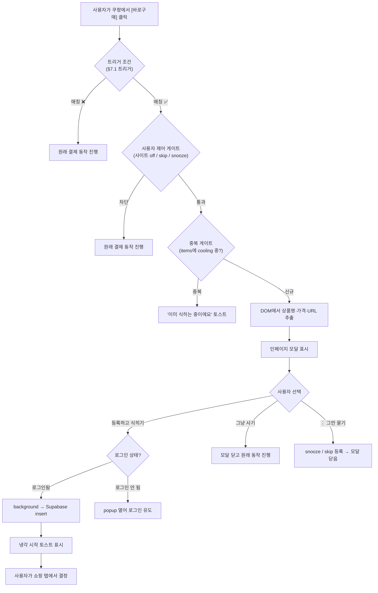

# 쿨링오프 브라우저 확장 — 기술 명세

> 이 문서는 확장 구현 시 참고하는 아키텍처·인증·주입 전략·인터페이스·의존성 명세입니다.
> 제품 결정과 정책은 [`../pm/prd.md`](../pm/prd.md), 설계 배경과 접근법 비교는 [`../README.md`](../README.md), 주차별 빌드 일정은 [`./build-plan.md`](./build-plan.md)을 보세요.

Status: DRAFT
Generated: 2026-05-20 (`/office-hours` 설계 메모에서 분리)

---

## 관련 문서

| 문서 | 경로 |
|------|------|
| 설계 개요 (Problem / Approaches / Premises) | [`../README.md`](../README.md) |
| 제품 요구사항 (정책 §7.1 포함) | [`../pm/prd.md`](../pm/prd.md) |
| 주차별 빌드 일정 | [`./build-plan.md`](./build-plan.md) |
| 본 서비스 PRD | [`../../pm/prd.md`](../../pm/prd.md) |
| 본 서비스 기술 메모 | [`../../engineering/tech-spec.md`](../../engineering/tech-spec.md) |
| 본 서비스 스키마 | `supabase/schema.sql` (저장소 루트) |
| Intervention Policy ADR | [`./adr/intervention-policy.md`](./adr/intervention-policy.md) |

---

## 1. 데이터 모델 정합성 (eng-review Issue 1)

확장은 **`public.items`** 테이블에 직접 insert한다 (`supabase/schema.sql` 참조). 별도 `registrations` 테이블을 만들지 않는다.

| 컬럼 | 확장이 보내는 값 |
|------|-----------------|
| `user_id` | `auth.uid()` (RLS가 자동 검증) |
| `name` | extractor가 추출한 상품명 (실패 시 popup에서 사용자가 보강) |
| `price` | extractor가 추출한 가격 (≥1, 실패 시 popup 입력) |
| `url` | `location.href` |
| `reason` | null (확장에서는 등록 단계에 이유 입력 안 받음 — Phase 2 후보) |
| `status` | 항상 `'cooling'`으로 시작 |
| `cooling_ends_at` | 확장이 `price + now()` 로 계산해서 보냄 (아래 cooling 로직 참조) |

RLS 정책(`auth.uid() = user_id`)이 이미 `schema.sql:71-83`에 있으므로 추가 변경 불필요.

---

## 2. Cooling 로직 공유 (eng-review Issue 2)

가격 → `cooling_ends_at` 계산 로직은 web의 `src/lib/cooling.ts`(본 서비스 tech-spec `변경 가능 항목 격리`)에 단일 정의된다. 확장은 같은 함수 본문을 **`extension/src/shared/cooling.ts`로 복사**한다 (5~10줄 함수).

드리프트 방지:

- CI에 스냅샷 테스트 추가 — 가격 레인지 `[1_000, 50_000, 100_000, 300_000, 1_000_000, 5_000_000]` 고정 입력으로 web과 확장의 두 함수가 같은 `Duration`을 반환하는지 검증.
- web에서 `cooling.ts`를 수정하는 PR은 확장 쪽 사본도 같이 수정 + 스냅샷 갱신해야 머지 가능 (CI 게이트).

이 결정은 `[Layer 1]` 단순 복사 + `[Layer 3]` "5줄 함수에 monorepo·DB 함수는 over-engineered"의 합. 본 서비스 tech-spec "변경 가능 항목 격리" 원칙 유지.

---

## 3. 아키텍처 개요

```
┌─────────────────────────────────────────────────────────────┐
│ 쇼핑 사이트 (쿠팡 / 네이버쇼핑 / 기타)                       │
│                                                              │
│   ┌──────────────────────────────────────────────┐          │
│   │ content-script (사이트별)                     │          │
│   │  - 구매 버튼 감지 (event delegation)          │          │
│   │  - 클릭 시 인페이지 모달 주입                  │          │
│   │  - 상품 정보 추출 (SiteExtractor 구현체)      │          │
│   └──────────────────────────────────────────────┘          │
│                       │                                      │
│                       │ chrome.runtime.sendMessage           │
│                       ▼                                      │
└─────────────────────────────────────────────────────────────┘
┌─────────────────────────────────────────────────────────────┐
│ 확장 백그라운드 (service worker, MV3)                        │
│  - Supabase 세션 유지                                        │
│  - 메시지 라우팅                                              │
│  - 등록 요청 → Supabase REST API 직접 호출                   │
└─────────────────────────────────────────────────────────────┘
┌─────────────────────────────────────────────────────────────┐
│ 확장 popup (manifest action)                                 │
│  - 로그인 UI (Supabase Browser SDK)                          │
│  - 등록 결과 확인 / 최근 등록 목록                            │
│  - 설정 (사이트별 on/off, snooze, skip list — PRD §7.1)      │
└─────────────────────────────────────────────────────────────┘
       │
       │ HTTPS (anon key + RLS)
       ▼
┌─────────────────────────────────────────────────────────────┐
│ Supabase (쿨링오프 웹과 공유 백엔드)                          │
│  - auth.users (Google OAuth 동일 ID 풀)                      │
│  - public.items (웹·확장 공통 테이블, status='cooling'으로 진입)│
│  - RLS: auth.uid() = user_id (schema.sql:72-83 기존 정책 재사용)│
└─────────────────────────────────────────────────────────────┘
```

---

## 4. 인증 흐름 (eng-review Issue 3)

확장은 **`chrome.identity.launchWebAuthFlow`** + Supabase 커스텀 storage 어댑터를 사용한다 (MV3 service worker에는 DOM·localStorage가 없으므로 표준 Supabase SDK 그대로는 동작 불가).

```
1. popup 또는 SW가 Supabase Authorization URL 구성
   (redirect_to = https://<EXTENSION_ID>.chromiumapp.org/)
2. chrome.identity.launchWebAuthFlow(authUrl, callback)
3. 사용자가 Google 로그인 완료 → redirect URL에 code 도착
4. code → Supabase로 보내서 session 교환
5. session을 chrome.storage.local에 저장 (커스텀 storage 어댑터로 supabase-js에 주입)
6. SW·popup·content script가 모두 같은 session 사용
```

선행 작업:

- Supabase 콘솔 → Authentication → URL Configuration에 `https://<EXTENSION_ID>.chromiumapp.org/` redirect URI 추가.
- `extension/src/shared/supabase-client.ts`에서 `createClient(url, anon, { auth: { storage: chromeStorageAdapter, persistSession: true } })` 형태로 초기화.

Supabase의 `@supabase/auth-ui-react`는 쓸 수 없다 — DOM 환경 가정. OAuth flow는 직접 구현.

---

## 5. 주입 전략 (eng-review Issue 7)

content script는 `*://*.coupang.com/*`, `*://shopping.naver.com/*` 같이 **도메인 수준에서 넓게** matches한다. 실제 동작 제어는 런타임에서:

```
1. content-script 시작 → SiteExtractor.matches(location.href) 확인
2. 상품 페이지면 → detectPurchaseIntent 등록 + 모달 준비
3. 비-상품 페이지면 → idle (이벤트 리스너 부착 안 함)
4. history.pushState / popstate 감지 → 1번부터 재실행
```

쿠팡·네이버쇼핑이 SPA이므로 `history.pushState`·`replaceState`를 monkey-patch해서 URL 변경을 가로채야 한다. 이 패턴은 표준이지만 테스트로 커버되어야 한다 (build-plan Week 0 fixture에 SPA 네비게이션 시나리오 포함).

게이트 적용 순서 (PRD §7.1 정책과 정합):

1. 트리거 매칭 — 바로구매·구매하기·결제 진행 버튼이면 진행. 장바구니·찜하기·일반 클릭은 즉시 통과(원래 동작).
2. 사용자 제어 게이트 (OR 결합 — 하나라도 매치하면 모달 안 뜸):
   - 전체 확장 비활성화 (Chrome UI) — content-script 자체가 안 돌아감
   - 사이트 토글 off (도메인 단위)
   - URL skip list 매치 (정규화된 URL hash)
   - 도메인 24h snooze 활성 (timestamp + 24h)
3. `items`에 `status='cooling'`인 동일 URL → 모달 대신 "이미 식히는 중이에요" 토스트 (EX-6 정책)
4. 위 모두 통과 시 모달 표시

> Fallback (EX-3, 확장 아이콘 직접 클릭)은 위 2단계를 우회한다 — 사용자의 명시적 의도이므로 사이트 off나 snooze가 있어도 popup이 동작. 단, 3단계(중복 등록 방지)는 그대로 적용.

---

## 6. 실패 경로 (eng-review Issue 4)

소프트 인터셉트 흐름에서 다음 4가지 실패 모드를 명시적으로 다룬다:

1. **Optimistic UI 금지** — 모달 [등록] 클릭 후 Supabase insert가 성공 응답을 반환하기 전까지 "냉각 시작" 토스트를 띄우지 않는다. 실패 시 모달 안에 인라인 에러 + [다시 시도] 버튼.
2. **Session expired** — insert 시 401 응답이 오면 SW가 자동으로 refresh token 시도. 실패하면 popup을 자동 열어 재인증 유도. 이때 사용자가 입력 중이던 상품 정보는 `chrome.storage.session`에 보관해서 재인증 후 복원.
3. **CSP-strict 호스트** — Shadow DOM 모달이 호스트 페이지의 CSP를 위반하지 않도록, 인라인 스타일이 아닌 `<style>` 태그를 Shadow DOM 내부에 주입. fixture에 CSP가 엄격한 사이트 1~2개를 포함해서 검증.
4. **이중 클릭 / 중복 등록** — content script에서 5초 debounce + 서버 측 `items` 테이블에 `(user_id, url)` 부분 unique constraint 추가 (`WHERE deleted_at IS NULL`). 충돌 시 모달은 "이미 등록된 항목이 있어요"를 표시.

→ Supabase 마이그레이션 1줄 추가 필요:

```sql
CREATE UNIQUE INDEX idx_items_user_url_active
  ON items (user_id, url)
  WHERE deleted_at IS NULL AND url IS NOT NULL;
```

---

## 7. 데이터 흐름 (소프트 인터셉트 시나리오)



---

## 8. 파일 구조 (예상)

```
extension/
├── manifest.json (MV3)
├── src/
│   ├── background/
│   │   └── service-worker.ts        # auth + 메시지 라우팅 + Supabase 호출
│   ├── content-scripts/
│   │   ├── coupang/index.ts         # 쿠팡 셀렉터 + 버튼 감지
│   │   ├── naver-shopping/index.ts  # 네이버쇼핑 셀렉터 + 버튼 감지
│   │   ├── fallback/index.ts        # URL+title만 추출
│   │   └── modal/                   # 공유 인페이지 모달 (Shadow DOM)
│   ├── popup/
│   │   ├── index.html
│   │   └── app.tsx                  # 로그인 + 최근 등록 + 정책 설정
│   └── shared/
│       ├── extractor.ts             # SiteExtractor 인터페이스
│       ├── policy.ts                # PRD §7.1 게이트 (가격/skip/snooze 적용)
│       ├── supabase-client.ts       # Browser SDK 래퍼
│       └── types.ts
└── tests/
    ├── extractors/
    │   ├── coupang.test.ts          # 저장된 HTML fixture로 검증
    │   └── naver-shopping.test.ts
    └── fixtures/                    # 실제 쿠팡·네이버쇼핑 페이지 HTML
```

---

## 9. 인터페이스 설계 (eng-review Issue 5)

```typescript
// shared/extractor.ts
interface ProductInfo {
  name: string;
  price: number | null;   // null이면 사용자가 popup에서 보강
  url: string;
  source: 'coupang' | 'naver-shopping' | 'fallback';
  confidence: 'high' | 'medium' | 'low';  // 평가용 메타데이터
}

interface SiteExtractor {
  /** 현재 URL이 이 추출기의 대상인지 (예: 쿠팡 상품 페이지 URL인지) */
  matches(url: string): boolean;

  /** 구매 버튼 클릭을 감지. onClick은 클릭 이벤트마다 호출됨.
   *  반환값은 cleanup 함수 — 비-상품 페이지로 이동하거나 정리 시 호출해 리스너를 해제한다.
   *  내부 구현은 EventTarget.addEventListener를 쓰며 RxJS 같은 외부 의존성 없음. */
  detectPurchaseIntent(onClick: (e: MouseEvent) => void): () => void;

  /** DOM에서 상품 정보 추출. 가격이 lazy-load되거나 SPA hydration 중일 수 있으므로 async.
   *  내부에서 MutationObserver + timeout으로 안정 상태를 기다린 뒤 반환. */
  extract(): Promise<ProductInfo>;
}
```

PRD §7.1 정책 게이트는 별도 모듈로 분리:

```typescript
// shared/policy.ts
interface PolicyDecision {
  show: boolean;
  reason?: 'site_disabled' | 'snoozed' | 'url_skipped' | 'already_cooling';
}

/** 추출된 상품에 대해 모달을 표시할지 결정. PRD §7.1 게이트 로직을 단일 함수로 캡슐화.
 *  V1에서는 가격·카테고리 게이트가 없음. Phase 2에 추가될 경우 reason 유니온 확장. */
async function shouldShowModal(product: ProductInfo): Promise<PolicyDecision>;
```

---

## 10. Dependencies

### 쿨링오프 웹(이 프로젝트)에서 필요한 변경

- **마이그레이션 1줄** — `items` 테이블에 `(user_id, url) WHERE deleted_at IS NULL AND url IS NOT NULL` 부분 unique index 추가 (§6 — 중복 등록 방지).
- **`src/lib/cooling.ts` 작성** — 본 서비스 tech-spec에 계획되었으나 미구현. 확장 작업 시작 *전에* web 측에 구현되어 있어야 확장이 복사 가능 (§2).
- **Supabase 콘솔 — Auth → URL Configuration** — `https://<EXTENSION_ID>.chromiumapp.org/` redirect URI 추가 (§4). EXTENSION_ID는 Week 0에 확정.
- **RLS 정책 확인** — `schema.sql:71-83`의 기존 정책 그대로 동작. 변경 불필요.
- **CORS** — Supabase REST API는 anon key 호출에 `Access-Control-Allow-Origin: *` 응답. 확장 호출 가능. 자체 API 라우트 호출 시 `chrome-extension://` 허용 필요 — 캡스톤 범위에선 불필요.

### 외부 의존성 (확장)

- `@supabase/supabase-js` (web의 `@supabase/ssr`이 아닌 raw client 사용 — 확장은 Next.js 환경이 아니므로).
- `@crxjs/vite-plugin` + Vite — MV3 빌드.
- TypeScript, ESLint — web 프로젝트와 같은 설정 미러.
- RxJS 사용 안 함 (Issue 5).

### 기존 코드 재사용 (eng-review 정리)

| 항목 | 출처 | 재사용 방식 |
|------|------|-----------|
| `items` 테이블 schema | `supabase/schema.sql` | 그대로 사용, 변경 없음 |
| RLS 정책 | `supabase/schema.sql:71-83` | 그대로 사용 |
| 가격→cooling 변환 | `src/lib/cooling.ts` (web에 신규 추가 예정) | 복사 + 스냅샷 테스트 |
| Supabase 타입 | `src/lib/supabase/types.ts` | 복사 또는 import (확장이 같은 DB 스키마 사용) |
| OAuth callback | `src/app/auth/callback/route.ts` | 사용 안 함 (확장은 자체 redirect URL 사용) |
| `createBrowserClient` 패턴 | `src/lib/supabase/client.ts` | 참고용 (확장은 storage 어댑터 다름) |

---

## 11. Reviewer Concerns

`/plan-eng-review` 1회 완료 (2026-05-20). 7개 이슈 모두 합의되어 본 문서에 반영됨:

| Issue | 영역 | 해결 위치 |
|-------|------|----------|
| 1 | Architecture | §1 데이터 모델 정합성 (P0) |
| 2 | Architecture | §2 cooling.ts 복사 + 스냅샷 테스트 (P1 DRY) |
| 3 | Architecture | §4 chrome.identity + custom storage (P1) |
| 4 | Architecture | §6 실패 경로 4가지 명시 (P1) |
| 5 | Code quality | §9 SiteExtractor 시그니처 정정 (P2) |
| 6 | Tests | `./build-plan.md` Week 0 인프라 + fixture 자동 수집 (P0) |
| 7 | Performance | §5 SPA 대응 + 주입 전략 (P2) |

미해결 결정: 없음.

추가 리뷰 (2026-05-25):

- 사람 리뷰어 정책 피드백 → PRD [§7.1 개입 정책](../pm/prd.md)으로 별도 명시. 정책 게이트는 §5 주입 전략, §9 `shared/policy.ts` 인터페이스로 본 문서에 반영.
