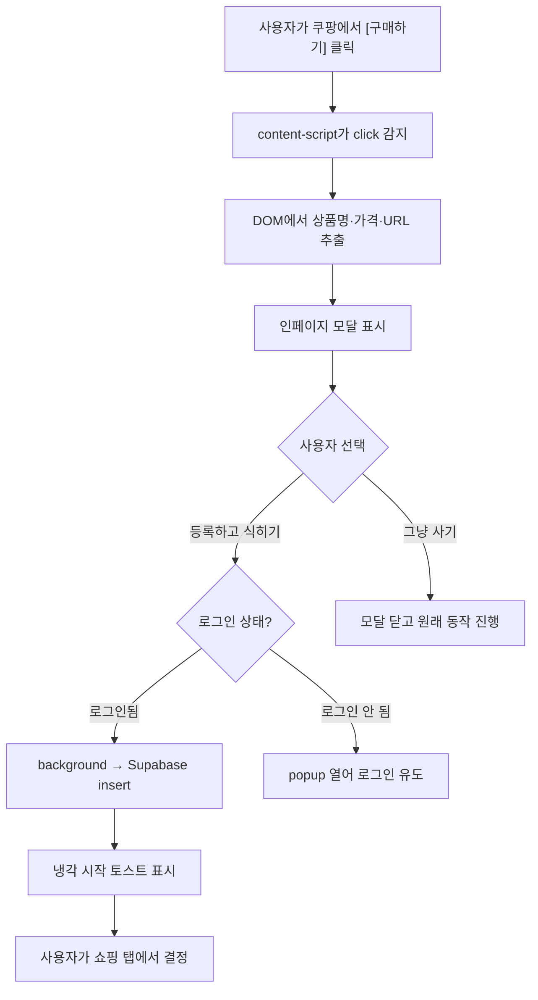

# Design: 쿨링오프 브라우저 확장 (Cooling-off Browser Extension)

Generated by /office-hours on 2026-05-20
Branch: docs/add-plugin-feature-docs
Repo: web-ppu/cooling-off
Status: DRAFT
Mode: Builder (학술 / 졸업 프로젝트 캡스톤 적용)

---

## Problem Statement

쿨링오프 웹 서비스(`prd.md` FR-1~FR-9)는 사용자가 사고 싶은 물건을 *수동으로* 등록해야 동작한다. 이는 구조적 한계를 만든다:

1. **개입 시점이 늦다.** 사용자는 이미 쇼핑 사이트에서 구매 의도가 식고 난 뒤에야 쿨링오프 웹으로 와서 등록한다. "구매 의도가 가장 뜨거운 순간"을 놓친다.
2. **등록 마찰이 크다.** FR-2가 요구하는 이름·가격·URL·이유를 사용자가 쇼핑 탭에서 따로 옮겨 적어야 한다. 이 마찰이 곧 이탈 포인트다.

브라우저 확장은 이 두 한계를 정확히 정조준한다 — 구매 버튼이 눌리는 그 순간에 끼어들고, 페이지의 상품 정보를 자동 추출해서 등록 마찰을 0에 가깝게 만든다.

## What Makes This Cool

쇼핑 사이트에서 "구매하기"를 누르는 순간, 인페이지 모달이 떠서 `"잠깐, 이거 쿨링오프에 등록하고 잠시 식혀볼까요?"`를 묻는다. [등록] 누르면 상품명·가격·URL이 자동으로 추출되어 쿨링오프에 들어가고, 가격에 따라 1~30일 냉각기가 자동 배정된다.

기존 웹 서비스가 *수동 일기장* 같았다면, 확장은 *반사 신경*이다. 시연 장면에서 청중이 "오, 저기서 끼어드네"라고 반응하는 그 한 순간이 이 제품의 정체성.

## Constraints

- 학술 캡스톤 일정 (실 구현 6~8주 가정).
- 한국 사용자 시장 우선. 쿠팡·네이버쇼핑이 1차 타겟.
- 쇼핑 사이트의 결제 흐름을 *물리적으로* 막지 않는다 (TOS 리스크, 체크아웃 흐름 파손 위험).
- 쿨링오프 백엔드는 이미 Supabase + Google OAuth. 확장은 같은 백엔드를 쓰지만 인증 컨텍스트는 별도다.
- 학술 평가는 `prd.md` "학술 성과" 기준 — 시연 가능한 핵심 루프 + 결정 근거 문서화.

## Premises (D5에서 확정)

1. **P1.** 핵심 가치는 "구매 의도가 가장 뜨거운 순간"에 끼어드는 것이다. 이걸 빼면 웹 서비스 대비 차별성이 사라진다.
2. **P2.** 확장은 결제 자체를 강제로 막지 않는다. 소프트 인터셉트 — 모달로 "쿨링오프에 등록하고 잠시 식혀볼까요?" + "그냥 사기"를 제시한다.
3. **P3.** 쿠팡 + 네이버쇼핑 1~2개를 제대로 잡고, 나머지 사이트는 URL+탭제목 fallback만 동작. "전 사이트 자동 추출"은 캡스톤 범위 밖이며, "의도된 범위 결정"으로 정당화한다.
4. **P4.** 확장은 Supabase Browser SDK로 독립 로그인을 가진다. 웹·확장은 같은 백엔드를 공유하지만 인증 컨텍스트는 별도 (= 사용자가 웹·확장에서 각각 한 번씩 로그인).
5. **P5.** 졸업 프로젝트 성공 기준은 `prd.md` "학술 성과"와 동일 — "핵심 루프 시연 가능 + 주요 결정 근거 문서화". 실 사용자 행동 변화의 정량 측정은 캡스톤 범위 밖, Phase 2 후보.

## Approaches Considered

### Approach A — 쿠팡 1개 폴리시 + 표준 fallback (안전 데모)
- Effort: S (4~6주). Risk: Low.
- 쿠팡만 깊이 통합. 나머지 사이트는 확장 아이콘 클릭 시 URL+탭제목만 등록.
- Pros: 시연 안정성 최고. 디버깅 부담 단일.
- Cons: 일반화 주장 약함.

### Approach B — 쿠팡 + 네이버쇼핑 + fallback (균형형) — **선택됨**
- Effort: M (6~8주). Risk: Med.
- 사이트별 content script 2개 + 공유 `SiteExtractor` 인터페이스 + 백그라운드 service worker로 세션 유지.
- Pros: "여러 한국 주력 사이트에서 동작"의 시각 증명. 추출기 추상화 자체가 발표거리.
- Cons: 셀렉터 디버깅 2배. 시연 중 한 사이트 셔상 시 전체 신뢰도 다운.

### Approach C — 쿠팡 폴리시 + 휴리스틱 일반화 (연구 지향)
- Effort: M (5~7주). Risk: Med-High.
- 쿠팡은 hand-tuned. 나머지는 휴리스틱(`구매/주문/결제` 텍스트 + 인근 가격 패턴) 기반 generic intercept.
- Pros: precision/recall trade-off가 thesis 장으로 들어감. 학술 기여 명확.
- Cons: 휴리스틱 false-positive 시 데모 곤란. 평가 데이터셋 구성 별도 1~2주.

## Recommended Approach — B

**B (쿠팡 + 네이버쇼핑 + fallback) 채택.**

이유:
- 캡스톤 평가에서 *시각적 증명력*이 가장 큰 가치 — 한국 사용자가 가장 익숙한 두 사이트에서 동시에 동작하면 "이게 진짜 쓰일 수 있는 도구"라는 인상이 강해진다.
- 두 추출기를 만드는 과정 자체가 발표 내용 — `SiteExtractor` 인터페이스 추상화, 사이트 간 공통점/차이점 비교가 자연스러운 챕터로 잡힌다.
- C의 휴리스틱 리스크(false-positive로 인한 데모 사고)를 피하면서 A보다 학술적 깊이를 확보.

### 데이터 모델 정합성 (eng-review Issue 1)

확장은 **`public.items`** 테이블에 직접 insert한다 (`supabase/schema.sql` 참조). 별도 `registrations` 테이블을 만들지 않는다.

| 컬럼 | 확장이 보내는 값 |
|------|-----------------|
| `user_id` | `auth.uid()` (RLS가 자동 검증) |
| `name` | extractor가 추출한 상품명 (실패 시 popup에서 사용자가 보강) |
| `price` | extractor가 추출한 가격 (≥1, 실패 시 popup 입력) |
| `url` | `location.href` |
| `reason` | null (확장에서는 등록 단계에 이유 입력 안 받음 — Phase 2 후보) |
| `status` | 항상 `'cooling'`으로 시작 |
| `cooling_ends_at` | 확장이 `price + now()` 로 계산해서 보냄 (아래 cooling 로직 참조) |

RLS 정책(`auth.uid() = user_id`)이 이미 `schema.sql:71-83`에 있으므로 추가 변경 불필요.

### Cooling 로직 공유 (eng-review Issue 2)

가격 → `cooling_ends_at` 계산 로직은 web의 `src/lib/cooling.ts`(tech-spec `변경 가능 항목 격리`)에 단일 정의된다. 확장은 같은 함수 본문을 **`extension/src/shared/cooling.ts`로 복사**한다 (5~10줄 함수).

드리프트 방지:
- CI에 스냅샷 테스트 추가 — 가격 레인지 `[1_000, 50_000, 100_000, 300_000, 1_000_000, 5_000_000]` 고정 입력으로 web과 확장의 두 함수가 같은 `Duration`을 반환하는지 검증.
- web에서 `cooling.ts`를 수정하는 PR은 확장 쪽 사본도 같이 수정 + 스냅샷 갱신해야 머지 가능 (CI 게이트).

이 결정은 `[Layer 1]` 단순 복사 + `[Layer 3]` "5줄 함수에 monorepo·DB 함수는 over-engineered"의 합. tech-spec "변경 가능 항목 격리" 원칙 유지.

### 아키텍처 개요

```
┌─────────────────────────────────────────────────────────────┐
│ 쇼핑 사이트 (쿠팡 / 네이버쇼핑 / 기타)                       │
│                                                              │
│   ┌──────────────────────────────────────────────┐          │
│   │ content-script (사이트별)                     │          │
│   │  - 구매·장바구니 버튼 감지 (event delegation) │          │
│   │  - 클릭 시 인페이지 모달 주입                  │          │
│   │  - 상품 정보 추출 (SiteExtractor 구현체)      │          │
│   └──────────────────────────────────────────────┘          │
│                       │                                      │
│                       │ chrome.runtime.sendMessage           │
│                       ▼                                      │
└─────────────────────────────────────────────────────────────┘
┌─────────────────────────────────────────────────────────────┐
│ 확장 백그라운드 (service worker, MV3)                        │
│  - Supabase 세션 유지                                        │
│  - 메시지 라우팅                                              │
│  - 등록 요청 → Supabase REST API 직접 호출                   │
└─────────────────────────────────────────────────────────────┘
┌─────────────────────────────────────────────────────────────┐
│ 확장 popup (manifest action)                                 │
│  - 로그인 UI (Supabase Browser SDK)                          │
│  - 등록 결과 확인 / 최근 등록 목록                            │
└─────────────────────────────────────────────────────────────┘
       │
       │ HTTPS (anon key + RLS)
       ▼
┌─────────────────────────────────────────────────────────────┐
│ Supabase (쿨링오프 웹과 공유 백엔드)                          │
│  - auth.users (Google OAuth 동일 ID 풀)                      │
│  - public.items (웹·확장 공통 테이블, status='cooling'으로 진입)│
│  - RLS: auth.uid() = user_id (schema.sql:72-83 기존 정책 재사용)│
└─────────────────────────────────────────────────────────────┘
```

### 인증 흐름 (eng-review Issue 3)

확장은 **`chrome.identity.launchWebAuthFlow`** + Supabase 커스텀 storage 어댑터를 사용한다 (MV3 service worker에는 DOM·localStorage가 없으므로 표준 Supabase SDK 그대로는 동작 불가).

```
1. popup 또는 SW가 Supabase Authorization URL 구성
   (redirect_to = https://<EXTENSION_ID>.chromiumapp.org/)
2. chrome.identity.launchWebAuthFlow(authUrl, callback)
3. 사용자가 Google 로그인 완료 → redirect URL에 code 도착
4. code → Supabase로 보내서 session 교환
5. session을 chrome.storage.local에 저장 (커스텀 storage 어댑터로 supabase-js에 주입)
6. SW·popup·content script가 모두 같은 session 사용
```

선행 작업:
- Supabase 콘솔 → Authentication → URL Configuration에 `https://<EXTENSION_ID>.chromiumapp.org/` redirect URI 추가.
- `extension/src/shared/supabase-client.ts`에서 `createClient(url, anon, { auth: { storage: chromeStorageAdapter, persistSession: true } })` 형태로 초기화.

Supabase의 `@supabase/auth-ui-react`는 쓸 수 없다 — DOM 환경 가정. OAuth flow는 직접 구현.

### 주입 전략 (eng-review Issue 7)

content script는 `*://*.coupang.com/*`, `*://shopping.naver.com/*` 같이 **도메인 수준에서 넓게** matches한다. 실제 동작 제어는 런타임에서:

```
1. content-script 시작 → SiteExtractor.matches(location.href) 확인
2. 상품 페이지면 → detectPurchaseIntent 등록 + 모달 준비
3. 비-상품 페이지면 → idle (이벤트 리스너 부착 안 함)
4. history.pushState / popstate 감지 → 1번부터 재실행
```

쿠팡·네이버쇼핑이 SPA이므로 `history.pushState`·`replaceState`를 monkey-patch해서 URL 변경을 가로채야 한다. 이 패턴은 표준이지만 테스트로 커버되어야 한다 (Issue 6의 fixture에 SPA 네비게이션 시나리오 포함).

### 실패 경로 (eng-review Issue 4)

소프트 인터셉트 흐름에서 다음 4가지 실패 모드를 명시적으로 다룬다:

1. **Optimistic UI 금지** — 모달 [등록] 클릭 후 Supabase insert가 성공 응답을 반환하기 전까지 "냉각 시작" 토스트를 띄우지 않는다. 실패 시 모달 안에 인라인 에러 + [다시 시도] 버튼.
2. **Session expired** — insert 시 401 응답이 오면 SW가 자동으로 refresh token 시도. 실패하면 popup을 자동 열어 재인증 유도. 이때 사용자가 입력 중이던 상품 정보는 `chrome.storage.session`에 보관해서 재인증 후 복원.
3. **CSP-strict 호스트** — Shadow DOM 모달이 호스트 페이지의 CSP를 위반하지 않도록, 인라인 스타일이 아닌 `<style>` 태그를 Shadow DOM 내부에 주입. fixture에 CSP가 엄격한 사이트 1~2개를 포함해서 검증.
4. **이중 클릭 / 중복 등록** — content script에서 5초 debounce + 서버 측 `items` 테이블에 `(user_id, url)` 부분 unique constraint 추가 (`WHERE deleted_at IS NULL`). 충돌 시 모달은 "이미 등록된 항목이 있어요"를 표시.

→ Supabase 마이그레이션 1줄 추가 필요:
```sql
CREATE UNIQUE INDEX idx_items_user_url_active
  ON items (user_id, url)
  WHERE deleted_at IS NULL AND url IS NOT NULL;
```

### 데이터 흐름 (소프트 인터셉트 시나리오)



### 파일 구조 (예상)

```
extension/
├── manifest.json (MV3)
├── src/
│   ├── background/
│   │   └── service-worker.ts        # auth + 메시지 라우팅 + Supabase 호출
│   ├── content-scripts/
│   │   ├── coupang/index.ts         # 쿠팡 셀렉터 + 버튼 감지
│   │   ├── naver-shopping/index.ts  # 네이버쇼핑 셀렉터 + 버튼 감지
│   │   ├── fallback/index.ts        # URL+title만 추출
│   │   └── modal/                   # 공유 인페이지 모달 (Shadow DOM)
│   ├── popup/
│   │   ├── index.html
│   │   └── app.tsx                  # 로그인 + 최근 등록
│   └── shared/
│       ├── extractor.ts             # SiteExtractor 인터페이스
│       ├── supabase-client.ts       # Browser SDK 래퍼
│       └── types.ts
└── tests/
    ├── extractors/
    │   ├── coupang.test.ts          # 저장된 HTML fixture로 검증
    │   └── naver-shopping.test.ts
    └── fixtures/                    # 실제 쿠팡·네이버쇼핑 페이지 HTML
```

### 인터페이스 설계 (핵심) — eng-review Issue 5

```typescript
// shared/extractor.ts
interface ProductInfo {
  name: string;
  price: number | null;   // null이면 사용자가 popup에서 보강
  url: string;
  source: 'coupang' | 'naver-shopping' | 'fallback';
  confidence: 'high' | 'medium' | 'low';  // 평가용 메타데이터
}

interface SiteExtractor {
  /** 현재 URL이 이 추출기의 대상인지 (예: 쿠팡 상품 페이지 URL인지) */
  matches(url: string): boolean;

  /** 구매·장바구니 버튼 클릭을 감지. onClick은 클릭 이벤트마다 호출됨.
   *  반환값은 도록해제 함수 — 비-상품 페이지로 이동하거나 cleanup 시 호출.
   *  내부 구현은 EventTarget.addEventListener를 쓰며 RxJS 같은 외부 의존성 없음. */
  detectPurchaseIntent(onClick: (e: MouseEvent) => void): () => void;

  /** DOM에서 상품 정보 추출. 가격이 lazy-load되거나 SPA hydration 중일 수 있으므로 async.
   *  내부에서 MutationObserver + timeout으로 안정 상태를 기다린 뒤 반환. */
  extract(): Promise<ProductInfo>;
}
```

## Open Questions

이 질문들은 캡스톤 진행 중 답이 나올 영역. 지금 결정하지 않는다.

- **Q1.** 쿠팡·네이버쇼핑의 DOM이 A/B 테스트로 자주 바뀌는데, 셀렉터 깨짐을 모니터링할 방법은? (Phase 2 후보: CI에 fixture 기반 셀렉터 회귀 테스트)
- **Q2.** 모달이 자동으로 떠야 하나, "확장 아이콘에 빨간 점" 같은 약한 신호로 사용자가 직접 호출하게 해야 하나? 사용자 테스트 1~2회로 확인.
- **Q3.** 가격이 추출되지 않은 경우(예: "회원가만 노출") popup에서 사용자가 직접 입력하게 fallback. 이 UX가 매끄러운지 확인 필요.
- **Q4.** 동일 URL을 짧은 기간 안에 여러 번 클릭하면 어떻게? (중복 등록 방지 vs 의도된 재등록 구분 — 웹 측 prd.md "열린 질문"과 동일)
- **Q5.** Manifest V2 종료 일정과 Firefox 차이 — MV3로 통일 가정. Firefox는 캡스톤 범위 밖.

## Success Criteria

`prd.md` 학술 성과 기준에 맞춰 정의:

1. **시연 가능 핵심 루프 완성**
   - 쿠팡 상품 페이지에서 [구매하기] 클릭 → 모달 표시 → [등록] → 쿨링오프에 항목 생성 → 가격 기준 냉각기 자동 배정. 이 흐름이 5초 안에 끝남.
   - 네이버쇼핑에서 같은 흐름.
   - 그 외 임의 사이트(예: 무신사)에서 확장 아이콘 클릭 시 URL+탭제목 등록 동작.

2. **결정 근거 문서화**
   - 이 design doc + 구현 중 추가된 ADR(architecture decision records).
   - 사이트별 추출기 비교 표 (셀렉터, 안정성, 깨짐 사례).
   - "왜 소프트 인터셉트인가" — TOS·법·UX 근거.
   - "왜 독립 인증인가" — UX 마찰 vs 권한 모델 트레이드오프.

3. **품질 게이트**
   - 쿠팡 fixture 50개에서 상품명 추출 95%+, 가격 추출 90%+ (실제 측정값을 보고서에 기재).
   - 네이버쇼핑 fixture 50개 동일 기준.
   - 인페이지 모달이 호스트 페이지의 스타일을 깨지 않는다 (Shadow DOM 격리).

### 측정하지 않는 지표

- 실제 사용자의 [안 삼] 선택률 변화 (Phase 2).
- 일·주간 활성 확장 사용자 수.
- 광범위 사이트 호환성 (의도적으로 1~2개 + fallback).

## Distribution Plan

캡스톤 범위로는 다음만 다룬다:

1. **개발용 배포**: Chrome 개발자 모드에서 unpacked 로드. 시연·심사용으로 충분.
2. **GitHub Releases**: 빌드된 `.zip`을 자동으로 release artifact로 업로드 (GitHub Actions). 평가자가 받아 설치 가능.
3. **Chrome Web Store**: **캡스톤 범위 밖.** 심사·결제·정책 검토 시간이 1~2주 추가로 들고, 학술적 기여와 무관. README에 "Phase 2 후보"로 기재.

CI/CD:
- GitHub Actions에서 PR마다 `npm run build` + extractor 회귀 테스트 (fixture 기반).
- main 브랜치 머지 시 zip artifact 자동 생성.

## Dependencies

### 쿨링오프 웹(이 프로젝트)에서 필요한 변경
- **마이그레이션 1줄** — `items` 테이블에 `(user_id, url) WHERE deleted_at IS NULL AND url IS NOT NULL` 부분 unique index 추가 (Issue 4 — 중복 등록 방지).
- **`src/lib/cooling.ts` 작성** — tech-spec에 계획되었으나 미구현. 확장 작업 시작 *전에* web 측에 구현되어 있어야 확장이 복사 가능 (Issue 2).
- **Supabase 콘솔 — Auth → URL Configuration** — `https://<EXTENSION_ID>.chromiumapp.org/` redirect URI 추가 (Issue 3). EXTENSION_ID는 Week 0에 확정.
- **RLS 정책 확인** — `schema.sql:71-83`의 기존 정책 그대로 동작. 변경 불필요.
- **CORS** — Supabase REST API는 anon key 호출에 `Access-Control-Allow-Origin: *` 응답. 확장 호출 가능. 자체 API 라우트 호출 시 `chrome-extension://` 허용 필요 — 캡스톤 범위에선 불필요.

### 외부 의존성 (확장)
- `@supabase/supabase-js` (web의 `@supabase/ssr`이 아닌 raw client 사용 — 확장은 Next.js 환경이 아니므로).
- `@crxjs/vite-plugin` + Vite — MV3 빌드.
- TypeScript, ESLint — web 프로젝트와 같은 설정 미러.
- RxJS 사용 안 함 (Issue 5).

### 기존 코드 재사용 (eng-review 정리)
| 항목 | 출처 | 재사용 방식 |
|------|------|-----------|
| `items` 테이블 schema | `supabase/schema.sql` | 그대로 사용, 변경 없음 |
| RLS 정책 | `supabase/schema.sql:71-83` | 그대로 사용 |
| 가격→cooling 변환 | `src/lib/cooling.ts` (web에 신규 추가 예정) | 복사 + 스냅샷 테스트 |
| Supabase 타입 | `src/lib/supabase/types.ts` | 복사 또는 import (확장이 같은 DB 스키마 사용) |
| OAuth callback | `src/app/auth/callback/route.ts` | 사용 안 함 (확장은 자체 redirect URL 사용) |
| `createBrowserClient` 패턴 | `src/lib/supabase/client.ts` | 참고용 (확장은 storage 어댑터 다름) |

## Next Steps (구체적 빌드 순서)

캡스톤 8주 일정 권장 (Week 0 설정 추가로 6주 압축은 빠듯):

**Week 0 — 인프라 설정 (eng-review Issue 6)**
- `extension/` 디렉토리 생성. 자체 `package.json` (web과 분리된 의존성).
- Vitest + JSDOM + Playwright 설치 + tsconfig.
- Vite + `@crxjs/vite-plugin` 빌드 파이프라인.
- GitHub Actions 워크플로 — PR마다 build + unit + extractor 회귀.
- **Fixture 수집 자동화**: `extension/scripts/collect-fixtures.ts` (Playwright) — 쿠팡·네이버쇼핑의 카테고리별 (가전·패션·도서·생활·식품 각 10개) 상품 페이지 HTML 5개씩 = 50개/사이트 다운로드. `extension/tests/fixtures/{coupang,naver-shopping}/` 에 git-tracked로 저장.
- Supabase 콘솔에 확장 redirect URI 등록 (Issue 3).
- `(user_id, url)` unique index 마이그레이션 적용 (Issue 4).

**Week 1 — 기반 + 인증**
- Manifest V3 스켈레톤. content-script + popup + background SW 골격.
- `chrome.identity.launchWebAuthFlow` 기반 OAuth 흐름 동작 확인.
- `shared/supabase-client.ts` — chrome.storage.local storage 어댑터.
- `shared/cooling.ts` 복사 + web↔확장 스냅샷 테스트 1개 추가.

**Week 2~3 — 쿠팡 추출기**
- `SiteExtractor` 인터페이스 확정 (`onClick` 콜백 + Promise extract).
- 쿠팡 셀렉터 작성, 50개 fixture 테스트 통과 (목표: 이름 95%+ / 가격 90%+).
- 인페이지 모달 (Shadow DOM, 호스트 스타일 격리, CSP-strict 검증).
- 주입 전략 구현 — history API monkey-patch + SPA URL 변경 감지.

**Week 4 — 네이버쇼핑 추출기**
- 쿠팡과 동일 인터페이스로 구현. 추상화의 유효성 검증.
- 50개 fixture 동일 기준.

**Week 5 — Fallback + 통합 + 실패 경로**
- 확장 아이콘 클릭 시 fallback 동작.
- 실패 경로 4가지 모두 구현 + 단위 테스트 (Issue 4).
- end-to-end 흐름(클릭 → 모달 → 등록 → 쿨링오프 웹에 반영) Playwright 테스트.

**Week 6 — 안정화 + 측정 + 문서**
- 셀렉터 회귀 테스트 CI 게이트.
- ADR 작성 (소프트 인터셉트, 독립 인증, chrome.identity 선택, 사이트별 추출기, cooling 로직 복사).
- 추출 품질 측정 스크립트 + precision 표 자동 생성.

**Week 7~8 — 발표 자료 + 환용**
- 시연 시나리오 리허설 (Playwright recording을 데모 백업으로 준비).
- 포스터·슬라이드.
- 시간 남으면: C 접근의 휴리스틱 fallback 요소 일부 추가 (논문 그래프 확장).

## What I noticed about how you think

- D2에서 내가 "B(원클릭 등록)"를 추천했을 때, 즉시 **A+B 하이브리드**로 응답했음 — "구매도 잠깐 차단하면서 상품 정보를 가져가서 등록"이라는 더 야심찬 조합을 직접 만들었다. 제시된 옵션을 그대로 받지 않고 *자기 의도*를 정확히 명시한 답이었다.
- D4에서 내 추천(C, 딥링크)을 거절하고 **B(독립 로그인)**를 골랐음. 가장 어려운 옵션이지만 "확장과 웹의 독립된 아키텍처"라는 학술적 주장을 우선시한 선택. 데모 안정성보다 *논거의 깔끔함*을 우선한 판단.
- D6에서는 반대로 안전 데모(A) 추천을 거절하고 **B(균형형, 두 사이트)**를 선택. 데모 리스크는 더 크지만 "여러 한국 주력 사이트에서 동작"의 *시각 증명*에 가치를 둔 판단. 일관되게 *시연의 설득력*과 *논거의 명확성*을 우선시함.
- prd.md / 기획-배경.md를 보면 쿨링오프 프로젝트 자체가 "안 사는 게임" 같은 흔한 함정을 의식적으로 회피하고 있다 — 결정 중립성, 외재 보상 금지, 절약 금액 미표시. 확장 설계에서도 같은 톤이 유지되어야 한다 (예: "오늘 X원 절약" 같은 게이미피케이션 추가 금지).

---

## NOT in scope (의도적 deferral)

다음 항목은 캡스톤 범위 밖이며, 빠진 게 아니라 *의도적으로* 뺀 것:

- **Chrome Web Store 정식 배포** — 심사·정책 검토 1~2주. dev 모드 로드 + GitHub Releases zip으로 시연·평가 충분.
- **Firefox 호환성** — MV3 + chrome.identity가 Firefox에서 다르게 동작 (browser.identity). 단일 브라우저(Chrome/Edge) 캡스톤 범위로 한정.
- **휴리스틱 일반 감지** (Approach C) — 시간 남으면 Week 7~8에 추가, 기본 범위엔 없음.
- **사용자 행동 정량 측정** — "안 삼" 선택률 변화 등은 Phase 2. 캡스톤은 prd.md "학술 성과"의 시연·문서화 기준만.
- **셀렉터 깨짐 자동 알림** — fixture 회귀 테스트만 캡스톤 범위. 프로덕션 모니터링은 Phase 2.
- **확장 ↔ web 세션 SSO** — 별도 로그인 유지 (Issue 3 결정). SSO는 Phase 2.

## TODOS

이 항목들은 캡스톤 후 Phase 2 후보로 보관:

- `TODO-1` Chrome Web Store 등록 + 자동 업데이트 파이프라인
- `TODO-2` 셀렉터 회귀 알림 (CI에서 fixture가 더 이상 매칭 안 하면 Slack/이메일)
- `TODO-3` Firefox 포트 (browser.identity 어댑터, manifest v2/v3 차이)
- `TODO-4` Heuristic generic intercept (Approach C의 휴리스틱 detector + precision/recall 분석)
- `TODO-5` Extension ↔ web 세션 공유 (cookie 또는 token relay)
- `TODO-6` 사용자 행동 정량 측정 (등록 후 [안 삼] 선택률, 7일 리텐션)

루트 `TODOS.md`가 생기면 위 항목을 옮길 것.

## Reviewer Concerns

`/plan-eng-review` 1회 완료 (2026-05-20). 7개 이슈 모두 합의되어 본 문서에 반영됨:

| Issue | 영역 | 해결 |
|-------|------|------|
| 1 | Architecture | `registrations` → `items` 정합성 (P0) |
| 2 | Architecture | cooling.ts 복사 + 스냅샷 테스트 (P1 DRY) |
| 3 | Architecture | chrome.identity + custom storage (P1) |
| 4 | Architecture | 실패 경로 4가지 명시 (P1) |
| 5 | Code quality | SiteExtractor 시그니처 정정 (P2) |
| 6 | Tests | Week 0 인프라 + fixture 자동 수집 (P0) |
| 7 | Performance | SPA 대응 + 주입 전략 (P2) |

미해결 결정: 없음.

---

## GSTACK REVIEW REPORT

| Review | Trigger | Why | Runs | Status | Findings |
|--------|---------|-----|------|--------|----------|
| CEO Review | `/plan-ceo-review` | Scope & strategy | 0 | — | — |
| Codex Review | `/codex review` | Independent 2nd opinion | 0 | — | — |
| Eng Review | `/plan-eng-review` | Architecture & tests (required) | 1 | CLEAR (PLAN) | 7 issues found, 7 resolved, 0 critical gaps |
| Design Review | `/plan-design-review` | UI/UX gaps | 0 | — | — |
| DX Review | `/plan-devex-review` | Developer experience gaps | 0 | — | — |

**UNRESOLVED:** 0
**VERDICT:** ENG CLEARED — ready to implement. 시작 전 권장: web 측 `src/lib/cooling.ts` 작성, `items` unique index 마이그레이션 적용, Supabase 콘솔에 확장 redirect URI 등록.
