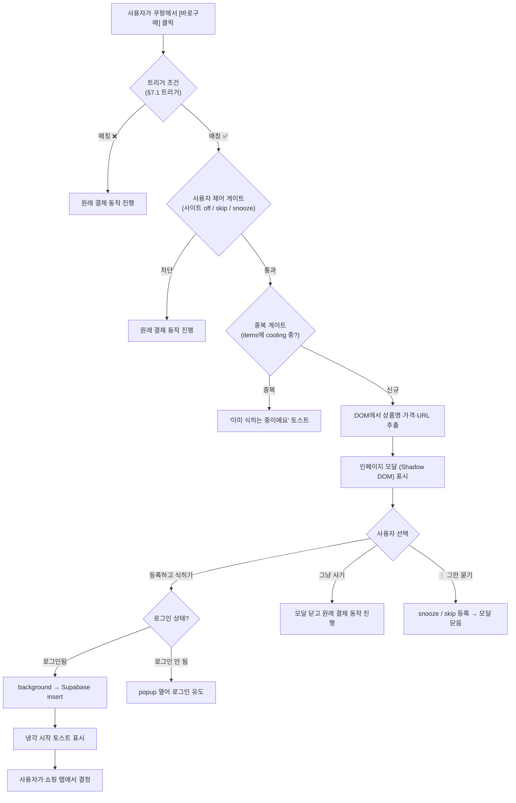
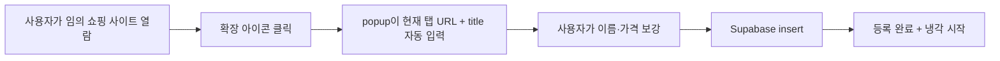

# 쿨링오프 브라우저 확장 PRD

> 이 문서는 쿨링오프 브라우저 확장의 기준 제품 문서입니다.
> 제품 목표, 사용자, 가치 제안, 핵심 흐름, 기능 범위, 릴리스 계획을 정의합니다.
>
> | 관련 문서 | 경로 |
> |----------|------|
> | 설계 개요 (design doc) | [`../README.md`](../README.md) |
> | 확장 기술 명세 | [`../engineering/tech-spec.md`](../engineering/tech-spec.md) |
> | 확장 빌드 작업 목록 | [`../engineering/build-plan.md`](../engineering/build-plan.md) |
> | 개입 정책 ADR | [`../engineering/adr/intervention-policy.md`](../engineering/adr/intervention-policy.md) |
> | 본 서비스 PRD | [`../../pm/prd.md`](../../pm/prd.md) |
> | 본 서비스 기획 배경 | [`../../pm/기획-배경.md`](../../pm/기획-배경.md) |
> | 본 서비스 화면 정책 | [`../../design/screen-spec.md`](../../design/screen-spec.md) |
> | 본 서비스 기술 메모 | [`../../engineering/tech-spec.md`](../../engineering/tech-spec.md) |

Status: DRAFT
Branch: docs/add-plugin-feature-docs
Generated: 2026-05-20 (`/pm-execution:create-prd` 기반 + `../README.md` 동기화)

---

## 1. 요약

쿨링오프 브라우저 확장은 쇼핑 사이트의 구매 결제 시점에 끼어들어, 사용자가 클릭 한 번으로 해당 상품을 쿨링오프 냉각기에 올릴 수 있게 하는 Chrome MV3 확장입니다. 본 서비스가 *수동 일기장*이라면 확장은 *반사 신경*이며, 같은 Supabase 백엔드를 공유하지만 인증·UI는 독립적으로 동작합니다.

---

## 2. 담당자

| 이름 | 역할 | 비고 |
|------|------|------|
| (작성자) | PM / 캡스톤 책임자 | `../../pm/prd.md`와 동일 |
| (작성자) | Frontend / Extension 개발 | content script + popup + SW 전부 담당 |
| 지도교수 | 평가·심사 | 시연 + 결정 근거 문서화로 평가 |

> 캡스톤 1인 프로젝트 가정. 외부 디자이너·QA·DevOps 없음.

---

## 3. 배경

### 무엇에 대한 것인가

쿨링오프 본 서비스(`../../pm/prd.md` FR-1~FR-9)는 사용자가 사고 싶은 물건을 *수동으로* 등록해야 동작합니다. 이는 두 가지 구조적 한계를 만듭니다.

1. **개입 시점이 늦다.** 사용자는 이미 쇼핑 사이트에서 구매 의도가 식고 난 뒤에야 쿨링오프 웹으로 와서 등록합니다. "구매 의도가 가장 뜨거운 순간"을 놓칩니다.
2. **등록 마찰이 크다.** FR-2가 요구하는 이름·가격·URL을 사용자가 쇼핑 탭에서 직접 옮겨 적어야 합니다. 이 마찰이 곧 이탈 포인트입니다.

확장은 이 두 한계를 정조준합니다 — 구매 버튼이 눌리는 그 순간에 끼어들고, 페이지의 상품 정보를 자동 추출해 등록 마찰을 0에 가깝게 줄입니다.

### 왜 지금인가

- 본 서비스 MVP가 등록·냉각·결정 루프를 검증한 상태. 확장은 그 루프의 *입구*만 교체합니다.
- Chrome MV3 + `chrome.identity.launchWebAuthFlow` 조합이 안정화되어, 확장에서도 Supabase 세션 유지가 가능해졌습니다.
- 확장은 기존 본 서비스와 결합도가 낮아 캡스톤 단위 모듈로 적합합니다.

---

## 4. 목표

### 무엇을, 왜

**목표**: 구매 의도가 가장 뜨거운 순간에 *5초 이내*로 쿨링오프 등록을 끝낼 수 있는 인터셉트 경험을 제공합니다.

**왜 중요한가**:

- 쿨링오프의 핵심 가치(충동과 합리화 분리)는 *등록 시점이 빠를수록* 더 잘 작동합니다.
- 본 서비스만으로는 "쇼핑 → 쿨링오프 탭 열기 → 정보 옮겨 적기" 마찰이 너무 큽니다. 이 마찰이 잠재 사용자 대부분을 잃습니다.
- 학술 평가 측면에서, 확장은 *시각적 시연력*이 매우 높습니다 — 쇼핑 사이트에서 모달이 떠 끼어드는 한 장면이 곧 제품 정체성입니다.

### Key Results (캡스톤 범위)

`../../pm/prd.md` "학술 성과" 기준에 맞춰 시연·문서 중심의 SMART KR을 정의합니다. 실 사용자 행동 변화의 정량 측정은 Phase 2.

| KR | 측정 방식 | 목표 |
|----|-----------|-----|
| KR-1. 쿠팡 상품 페이지에서 클릭 → 모달 → 등록 → 냉각 시작 토스트까지 *5초 이내* | Playwright recording의 wall-clock 측정 | 시연 5회 중 5회 성공 |
| KR-2. 쿠팡 fixture 50개 기준 상품명 추출 정확도 *95%+* | 자동 회귀 테스트 | 50개 중 48개 이상 |
| KR-3. 쿠팡 fixture 50개 기준 가격 추출 정확도 *90%+* | 자동 회귀 테스트 | 50개 중 45개 이상 |
| KR-4. 네이버쇼핑 fixture 50개 기준 KR-2, KR-3 동일 기준 충족 | 자동 회귀 테스트 | 위와 동일 |
| KR-5. fallback(임의 사이트 + 확장 아이콘 클릭)으로 URL+탭제목 등록 동작 | 수동 시연 | 사이트 3개 이상에서 성공 |
| KR-6. 주요 결정의 근거 문서화 (ADR 5종 이상) | `docs/plugin/` 내 markdown | 5건 작성 완료 |

### 측정하지 않는 지표 (의도적 제외)

- 실제 사용자의 [안 삼] 선택률 변화 (Phase 2).
- 일·주간 활성 확장 사용자 수.
- Chrome Web Store 다운로드·평점.
- 광범위 사이트 호환성 (의도적으로 2개 + fallback).

---

## 5. 타겟 사용자 / 시장

### Primary: 합리화형 충동구매자 중 *쇼핑 시점에 모바일이 아닌 PC를 쓰는* 사용자

본 서비스의 Primary 사용자(`../../pm/prd.md` §2)와 동일한 *합리화형 충동구매자*입니다. 다만 확장은 데스크톱 Chrome 환경 한정이므로, 그 중에서도 PC로 쿠팡·네이버쇼핑을 사용하는 사용자가 1차 대상입니다.

대표적인 사용 맥락:
- 사무실·재택에서 점심시간·퇴근 직전에 쿠팡 장바구니를 정리하다가 결제까지 가는 사람.
- 네이버쇼핑 가격비교 탭을 열어 두고 "이게 진짜 싸다"를 합리화하는 사람.

### 타겟이 아닌 사용자

| 유형 | 제외 이유 |
|------|----------|
| 모바일 단독 사용자 | 캡스톤 범위 내 모바일 확장은 다루지 않음 |
| Firefox·Safari 사용자 | MV3 + chrome.identity 가정. 호환성은 Phase 2 |
| 본 서비스의 *과시형·수집형·생활비 습관* 비대상 사용자 | `../../pm/prd.md` §2와 동일하게 제외 |

### 제약

- 한국 사용자 시장 우선. 쿠팡·네이버쇼핑이 1차 타겟.
- 결제 흐름을 *물리적으로* 막지 않음 (TOS 리스크 + 체크아웃 흐름 파손 회피).
- 확장은 본 서비스와 같은 Supabase 백엔드를 쓰지만 인증 컨텍스트는 별도.

---

## 6. 가치 제안

### 사용자가 얻는 것

- **시점**: 구매 결정이 가장 뜨거운 순간(구매 버튼 클릭)에 인터셉트가 들어옵니다. 본 서비스가 못 잡는 그 5초를 정확히 잡습니다.
- **마찰 제거**: 이름·가격·URL을 *자동으로* 추출해 클릭 한 번으로 등록합니다. 사용자가 옮겨 적을 필요가 없습니다.
- **결정의 자유**: 모달은 강제로 결제를 막지 않습니다. "쿨링오프에 등록하고 식혀볼까요?" / "그냥 사기" 두 선택지를 동등하게 제시합니다.
- **연속성**: 등록한 항목은 같은 쿨링오프 계정에 들어가 본 서비스 홈 / 알림 / AI 채팅 흐름을 그대로 탑니다.

### 사용자가 피하는 페인

- "사고 나서 후회할 것 같은데 일단 결제부터 하는" 충동의 시점-마찰.
- 쇼핑 탭과 쿨링오프 탭을 오가며 정보를 옮겨 적는 수고.
- 본 서비스를 *기억해서* 다시 열어야 하는 인지 부담.

### 경쟁 제품 대비 차별점 (Value Curve)

| 축 | "결제 강제 차단" 앱 | "장바구니 보관" 기능 | **쿨링오프 확장** |
|------|:---:|:---:|:---:|
| 결제를 물리적으로 막는가 | 높음 | 낮음 | **낮음** (의도적) |
| 등록 마찰 | 중 | 낮음 | **매우 낮음** |
| 의사결정 시점 개입 | 사후 후회 시점 | 구매 직전 표시만 | **구매 클릭 순간** |
| 사용자 자율성 존중 | 낮음 | 중 | **높음** |
| 게이미피케이션 (절약 금액, 스트릭) | 있음 | 없음 | **없음** (의도적) |

→ "결정 중립성 + 시점 정확성 + 마찰 0"의 조합이 다른 제품에서 동시에 제공되지 않습니다.

### 가치 곡선상의 의도된 약점

- *전체 쇼핑 사이트 자동 인식*: 캡스톤 범위에서 쿠팡 + 네이버쇼핑 2개만 정조준. 그 외는 fallback. (`../README.md` P3)
- *결제 차단 강제*: 안 합니다. 소프트 인터셉트로 의도적으로 약화. (P2)
- *모바일 지원*: 없음. PC Chrome 우선.

---

## 7. 솔루션

### 7.1 개입 정책 (Intervention Policy)

> **리뷰 반영 (2026-05-25)**: 코드 레벨 설계 이전에 "어떤 구매에 끼어들 것인가"를 먼저 정의해야 한다는 피드백을 반영합니다. 이 절은 V1 정책을 명시하고, 미해결 항목은 §7.5 가정 / §9 열린 질문으로 위임합니다.

이 확장의 핵심 가치는 *모든 구매를 막는 것*이 아니라 *충동·후회 가능성이 높은 구매*에 한정해 식히는 시간을 주는 것입니다. 정책 부재 시 생필품·식료품·반복 구매에도 모달이 떠 사용자가 확장을 삭제할 위험이 큽니다. 다음 네 축으로 V1 정책을 고정합니다.

#### 트리거 조건 — 어떤 행동을 인터셉트하는가

| 사용자 행동 | V1 인터셉트 | 비고 |
|------------|:---------:|------|
| "바로구매" / "지금 구매" 클릭 | ✅ | 결제 직전이라 cooling 가치가 가장 큼 |
| "구매하기" / 결제 진행 클릭 | ✅ | 동일 이유 |
| "장바구니 담기" 클릭 | ❌ | 노이즈가 크고 결정 시점이 아님. Phase 2 검토 |
| "찜하기" / "관심상품" | ❌ | 관여도 낮음, 노이즈 큼 |
| 단순 페이지 진입·스크롤 | ❌ | 구매 의도가 정해지지 않은 시점 |

> 초안에는 장바구니도 트리거에 포함되어 있었으나, 본 절 결정으로 V1에서 제외합니다. EX-1 사양도 이에 맞춰 수정합니다.

#### 제외 조건 — 어떤 구매를 거를 것인가

| 기준 | V1 처리 | 근거 |
|------|---------|------|
| 카테고리(생필품·식료품 등) 자동 분류 | **V1 미지원** | 휴리스틱 false-positive 리스크 큼. `../README.md` Approach C에서 배제된 결정과 동일 |
| 가격 기반 자동 제외 (예: "10,000원 미만은 통과") | **V1 미지원** | 본 서비스 cooling tier(`../../pm/prd.md` §4.가격별 냉각기)는 5만원 이하도 1일 cooling을 부여하므로, "cooling 미적용 가격대"가 존재하지 않음. 확장이 임의로 가격을 자르면 본 서비스 정책과 불일치. 사용자가 가격대별 임계를 원한다는 검증이 나오면 Phase 2 (`TODO-9`)로 도입 |
| 사용자가 명시적으로 제외한 도메인·URL | 모달 표시 안 함 | 아래 "사용자 제어권" 참조 |
| `items`에 이미 `status='cooling'`인 동일 URL | 모달 대신 "이미 식히는 중이에요" 토스트 | EX-6 중복 방지와 통합 |

> **카테고리 분류를 V1에서 빼는 이유**: 쿠팡·네이버쇼핑이 명시적인 "생필품" 라벨을 일관되게 노출하지 않습니다. URL·상품명 휴리스틱으로 추정하면 false-positive(예: "초콜릿 선물세트"를 식료품으로 분류)가 발생하며, 캡스톤 범위에서 신뢰할 분류기를 구축할 수 없습니다. 대신 사용자 제어권으로 우회하고, Phase 2에서 사용자 라벨링 데이터를 모은 뒤 검토합니다 (`TODO-7`).
>
> **가격 게이트를 V1에서 빼는 이유**: 노이즈를 줄이는 가장 직관적인 방법은 가격 임계지만, 그 임계를 정당화할 데이터가 V1 시점에 없습니다. 본 서비스 cooling 정책과 정합을 우선하고, 노이즈는 "사용자 제어권"으로 해결합니다. 사용자 테스트에서 "이 가격대는 모달 없어도 괜찮다"는 신호가 모이면 Phase 2 `TODO-9`로 가격 임계를 도입.

#### 빈도 제한 — 얼마나 자주 띄울 것인가

| 단위 | V1 정책 |
|------|---------|
| 동일 URL | 1회만. 이미 `items`에 있으면 표시 안 함 (EX-6 부분 unique index가 자연스럽게 강제) |
| 동일 도메인 | 일일 cap 없음. 단, 사용자가 "오늘 이 사이트 그만 묻기"를 누르면 24h snooze |
| 전역 | 일일 cap 없음 |

> **전역 cap을 두지 않는 이유**: cap에 도달한 뒤 사용자가 진짜 충동구매를 할 때 모달이 안 뜨면 본 제품의 핵심 가치를 깎습니다. 빈도 자체를 일률적으로 줄이기보다, 노이즈가 큰 사이트는 *사용자가 직접 끄는 경로*로 해결합니다 (아래 사용자 제어권).

#### 사용자 제어권 — 사용자가 직접 끄는 방법

popup 설정 메뉴와 모달 내 옵션으로 제공:

| 컨트롤 | 동작 | 저장 위치 |
|--------|------|-----------|
| 사이트별 on/off 토글 (popup) | 도메인 단위 비활성. 토글이 off면 해당 도메인 content-script가 동작 중에 모달을 만들지 않음 | `chrome.storage.sync` |
| "이 사이트 24시간 그만 묻기" (모달 내 ⋮ 메뉴) | 누른 시점부터 24시간 동안 같은 도메인의 모달 표시 안 함. 24h 경과 후 자동 만료 | `chrome.storage.local` (snooze-until timestamp) |
| "이 URL 다시 묻지 않기" (모달 내 ⋮ 메뉴) | 정규화된 URL을 영구 skip list에 등록. 같은 URL은 다시 모달 안 뜸 | `chrome.storage.sync` (URL 정규화 후 hash) |
| 전체 확장 비활성화 | Chrome 기본 확장 관리 UI 사용. content-script 자체가 로드되지 않음 | — |

> **모달 내 버튼 위치**: 1차 액션은 [등록하고 식히기] / [그냥 사기]. "그만 묻기" 류는 모달 우측 상단 ⋮ 메뉴에 둡니다. 이 옵션이 primary만큼 눈에 띄면 사용자가 진짜 cooling이 필요한 시점에 무의식적으로 꺼버릴 가능성이 큽니다. (모달 디자인은 `/plan-design-review` 시점에 재검토.)

#### 게이트 적용 순서 (소프트 인터셉트 경로)

구매 버튼 클릭부터 모달 표시까지 다음 순서로 게이트를 통과합니다. 한 단계에서 차단되면 그 아래는 평가하지 않습니다.

1. **트리거 매칭** — 위 "트리거 조건" 표의 ✅ 행만 진행. ❌ 행은 즉시 통과(원래 동작).
2. **사용자 제어 게이트** (OR 결합 — 하나라도 매치하면 모달 안 뜸):
   - 전체 확장 비활성화 (Chrome UI)
   - 사이트 토글 off (도메인 단위)
   - URL skip list 매치
   - 24h snooze 활성 (도메인 단위)
3. **중복 게이트** — `items`에 `status='cooling'`인 동일 URL이 있으면 모달 대신 "이미 식히는 중이에요" 토스트.
4. 위 모두 통과 → 정보 추출 + 모달 표시.

> **컨트롤 우선순위는 두지 않음, OR 결합으로 충분**: 4개 컨트롤이 "어떤 게 우선?"이 아니라 "하나라도 매치하면 끔"이라 모호함이 없습니다. 사용자가 같은 URL에 대해 사이트 토글 off + URL skip을 동시에 걸어도 결과는 같음 (모달 안 뜸).

#### Fallback(EX-3)에 대한 정책 적용

확장 아이콘 직접 클릭은 **사용자의 명시적 의도**이므로 위 2단계(사용자 제어 게이트)를 우회합니다. 사이트 토글 off나 snooze 상태에서도 popup이 동작해 등록 가능. 단, 3단계(중복 게이트)는 동일하게 적용 — 이미 등록된 URL은 popup에서 "이미 식히는 중이에요"로 안내.

#### 정책 검증 계획

위 정책은 *가정*이며, 캡스톤 진행 중 다음 방식으로 검증합니다.

- 유사 확장 조사로 경쟁 제품의 트리거·제외·빈도·제어 정책 5건 이상 정리 (Q6, `TODO-10`) — **1차 완료**: Icebox·Impause·Checkout Chill·Pause·일반 차단기 5종을 [`../engineering/adr/intervention-policy.md`](../engineering/adr/intervention-policy.md) §3에 정리. 5종 모두 가격 게이트·카테고리 자동 분류가 없어 본 정책 결정을 뒷받침.
- 사용자 테스트 1~2회에서 "노이즈로 느꼈는가 / 어디서 끄고 싶었는가"를 인터뷰. 결과는 ADR 추가 또는 정책 수정으로 반영.
- 본 정책 결정의 근거는 별도 ADR ([`../engineering/adr/intervention-policy.md`](../engineering/adr/intervention-policy.md))로 분리해 발표 자료에 포함.

#### V1에서 제외한 정책 항목 (Phase 2 후보)

- 카테고리 자동 분류 기반 제외 (`TODO-7`)
- 사용자 행동 학습 기반 동적 빈도 조절 (`TODO-8`)
- 가격 threshold의 사용자 커스터마이즈 (`TODO-9`)
- 유사 확장 비교 정리 (`TODO-10`)

### 7.2 사용자 흐름 (UX 와이어플로우)

**소프트 인터셉트 시나리오** ([`../engineering/tech-spec.md`](../engineering/tech-spec.md) §7과 동기화):

**Fallback 시나리오** (쿠팡·네이버쇼핑이 아닌 임의 사이트):

### 7.3 핵심 기능

확장 기능은 본 서비스 PRD의 FR-1~FR-9와 충돌하지 않으며, **등록 단계만 교체**합니다. 등록 이후의 냉각·AI 채팅·결정·기록은 본 서비스 흐름을 그대로 사용합니다.

#### EX-1. 사이트별 구매 의도 인터셉트

| 항목 | 사양 |
|------|------|
| 대상 사이트 | 쿠팡 (`*://*.coupang.com/*`), 네이버쇼핑 (`*://shopping.naver.com/*`) |
| 트리거 | "바로구매" / "지금 구매" / "구매하기" / 결제 진행 버튼 클릭 (event delegation). **"장바구니 담기"는 V1 제외** (§7.1 트리거 정책) |
| 제외 게이트 | 사용자 skip list / 사이트 off / 24h snooze 적용 시 모달 표시 안 함 (§7.1 사용자 제어권). V1 가격·카테고리 게이트는 없음 |
| 중복 게이트 | `items`에 cooling 중인 동일 URL이 있으면 모달 대신 "이미 식히는 중이에요" 토스트 |
| SPA 대응 | `history.pushState` / `replaceState` monkey-patch로 URL 변경 감지 |
| 모달 | Shadow DOM 격리, 호스트 스타일 영향 없음, CSP-strict 사이트에서도 동작 |
| 사용자 선택 | [등록하고 식히기] / [그냥 사기] 동등 비중 (FR-6 결정 중립성 원칙 준수). 우측 상단 ⋮ 메뉴에 "오늘 이 사이트 그만 묻기" / "이 URL 다시 묻지 않기" |
| 결제 차단 | 하지 않음 — [그냥 사기]는 원래 클릭 동작을 그대로 진행 |

#### EX-2. 자동 상품 정보 추출

| 필드 | 추출 방식 | 실패 시 |
|------|----------|---------|
| 이름 | 사이트별 셀렉터 + MutationObserver 안정 상태 대기 | popup에서 사용자가 보강 |
| 가격 | 사이트별 셀렉터, 숫자 normalize | popup에서 사용자가 입력 |
| URL | `location.href` | (실패 없음) |

추출 결과는 `ProductInfo` 인터페이스로 표준화하며, `confidence: 'high' | 'medium' | 'low'` 메타데이터를 함께 기록합니다 (평가용).

#### EX-3. Fallback 등록

- 확장 아이콘 클릭 시 popup이 현재 탭의 `url`과 `title`을 자동 입력.
- 사용자가 이름·가격을 보강하면 본 서비스와 동일하게 `items` 테이블에 insert.
- 이름·가격 유효성 기준은 본 서비스 FR-2를 그대로 따름.

#### EX-4. 독립 로그인 (Supabase + chrome.identity)

- `chrome.identity.launchWebAuthFlow`로 OAuth 시작.
- Redirect URI: `https://<EXTENSION_ID>.chromiumapp.org/`.
- 세션은 `chrome.storage.local`에 저장 (커스텀 storage 어댑터로 supabase-js에 주입).
- 본 서비스와 같은 사용자 계정이지만, 웹·확장은 각각 한 번씩 로그인합니다.

#### EX-5. Supabase 직접 insert + RLS

- 확장은 별도 백엔드 없이 Supabase REST를 직접 호출.
- `items` 테이블에 insert. `status='cooling'`, `cooling_ends_at`은 확장에서 `price + now()`로 계산.
- 기존 RLS 정책(`auth.uid() = user_id`, `supabase/schema.sql:71-83`) 그대로 동작. 정책 변경 불필요.

#### EX-6. 중복 등록 방지

- content-script 측 5초 debounce.
- DB 측 부분 unique index (`items (user_id, url) WHERE deleted_at IS NULL AND url IS NOT NULL`).
- 충돌 시 모달은 "이미 등록된 항목이 있어요" 표시.

#### EX-7. 실패 경로 명시 ([`../engineering/tech-spec.md`](../engineering/tech-spec.md) §6 그대로 반영)

1. **Optimistic UI 금지** — insert 성공 응답 전까지 토스트 띄우지 않음. 실패 시 인라인 에러 + [다시 시도].
2. **Session expired** — 401 시 SW가 refresh token 시도, 실패 시 popup으로 재인증 유도. 입력 중이던 데이터는 `chrome.storage.session`에 보관.
3. **CSP-strict 호스트** — Shadow DOM 내부에 `<style>` 태그 주입 (인라인 스타일 금지).
4. **이중 클릭 / 중복 등록** — debounce + DB unique index 조합.

### 7.4 기술 (참고)

상세는 [`../engineering/tech-spec.md`](../engineering/tech-spec.md) §3 아키텍처 개요 참조. PRD 수준에서는 다음 결정만 명시:

- **Manifest V3** 단일. V2는 다루지 않음.
- **Chrome / Edge** 우선. Firefox 호환성은 Phase 2.
- **빌드**: Vite + `@crxjs/vite-plugin`.
- **테스트**: Vitest + JSDOM (단위), Playwright (e2e, fixture 수집).
- **공유 로직 (cooling.ts)**: 본 서비스의 `src/lib/cooling.ts`를 *복사* + CI 스냅샷 테스트로 드리프트 방지. monorepo 없음.

### 7.5 가정

확장 설계가 의존하는 가정. 캡스톤 진행 중 검증 또는 폐기.

| ID | 가정 | 검증 방식 |
|----|------|-----------|
| A1 | 쿠팡·네이버쇼핑의 구매 버튼은 셀렉터 1~2개로 안정적으로 잡힌다 | fixture 50개 수집 후 셀렉터 회귀 테스트 |
| A2 | 사용자는 "쿨링오프 등록"과 "구매 진행"이 동등하게 제시될 때 비합리적 클릭을 하지 않는다 | 사용자 테스트 1~2회 (Phase 2 또는 발표 직전) |
| A3 | `chrome.identity.launchWebAuthFlow` + Supabase OAuth 콜백이 안정적으로 동작한다 | PoC |
| A4 | 본 서비스의 cooling 로직은 확장 출시 시점에 이미 `src/lib/cooling.ts`로 분리되어 있다 | 본 서비스 작업 의존 — 확장 시작 전 처리 |
| A5 | 사용자가 웹·확장에 각각 로그인하는 부담을 받아들인다 | 사용자 테스트로 확인. 안 된다면 Phase 2의 SSO 검토 |

---

## 8. 릴리스

### 해야 하는 일

[`../engineering/build-plan.md`](../engineering/build-plan.md)에 작업 항목과 의존성이 상세히 확정되어 있으며, 본 PRD는 그것을 다음과 같이 묶습니다.

### V1 (캡스톤 시연 범위)

| 단계 | 내용 |
|------|------|
| 인프라 + 인증 | 빌드 파이프라인, fixture 자동 수집, OAuth 흐름, cooling.ts 복사 + 스냅샷 |
| 쿠팡 추출기 | SiteExtractor 인터페이스, 50 fixture 통과, 인페이지 모달, SPA 주입 전략 |
| 네이버쇼핑 추출기 | 같은 인터페이스 재사용, 50 fixture 통과 |
| Fallback + 통합 + 실패 경로 | 확장 아이콘 클릭 fallback, 실패 경로 4가지 + e2e |
| 안정화 + 측정 + 문서 | 회귀 게이트, ADR 5종, 추출 품질 측정 자동화 |
| 발표 + 리허설 | 시연 리허설, Playwright recording 백업, 포스터·슬라이드 |

**V1 포함**:
- 쿠팡 + 네이버쇼핑 인터셉트 (EX-1, EX-2).
- 임의 사이트 fallback (EX-3).
- 독립 로그인 + Supabase 직접 insert (EX-4, EX-5).
- 중복 등록 방지, 실패 경로 4종 (EX-6, EX-7).
- GitHub Releases zip 배포 + Chrome 개발자 모드 unpacked 로드.

### V2 / Phase 2 후보 (캡스톤 범위 밖)

`../README.md` TODOS와 동기화. 본 PRD는 다음을 *의도적으로* V1에서 제외합니다.

- `TODO-1` Chrome Web Store 정식 등록 + 자동 업데이트 파이프라인.
- `TODO-2` 셀렉터 회귀 알림 (CI fixture 미매칭 시 Slack/이메일).
- `TODO-3` Firefox 포트 (`browser.identity` 어댑터, manifest 차이).
- `TODO-4` Heuristic generic intercept (`../README.md` Approach C 휴리스틱 detector).
- `TODO-5` 확장 ↔ 본 서비스 세션 SSO.
- `TODO-6` 실 사용자 행동 정량 측정 ([안 삼] 선택률 변화, 7일 리텐션).

### 만들지 않는 것 (본 서비스와 동일하게 유지)

- 절약 금액 누적·표시.
- [안 삼] 비율 또는 스트릭.
- 게이미피케이션 ("오늘 X원 절약" 토스트 등 금지).
- 결제 강제 차단.
- 쇼핑중독 치료 기능.

### 시연 평가 기준 (학술 평가용)

`../../pm/prd.md` §7 "학술 성과"와 동일한 기준 + 확장 고유 항목:

1. **핵심 루프 시연**: 쿠팡 클릭 → 모달 → 등록 → 토스트 → 본 서비스 홈에 반영. 5초 이내. (KR-1)
2. **결정 근거 문서화**: 본 PRD + `../README.md` + ADR 5종. (KR-6)
3. **품질 게이트**: 50 fixture 추출 정확도 충족. (KR-2~4)

---

## 9. 열린 질문

본 서비스 PRD의 §10과 별개로, 확장 고유의 열린 질문:

- Q1. 쿠팡·네이버쇼핑 DOM이 A/B 테스트로 자주 바뀌는데, 셀렉터 깨짐을 어떻게 모니터링할 것인가? (Phase 2 후보: TODO-2)
- Q2. 모달이 자동으로 떠야 하나, "확장 아이콘에 빨간 점" 같은 약한 신호로 사용자가 직접 호출하게 해야 하나? (사용자 테스트 1~2회로 확인)
- Q3. 가격이 추출되지 않은 경우(예: "회원가만 노출") popup fallback UX가 매끄러운가?
- Q4. 동일 URL을 짧은 기간 안에 여러 번 클릭하면? — 본 서비스 `../../pm/prd.md` "열린 질문"과 동일 영역, DB unique index로 1차 방어.
- Q5. 사용자가 웹·확장 각각 로그인하는 부담이 등록 전환율을 얼마나 깎는가? (A5 검증)
- Q6. 유사 확장(Chrome 웹스토어의 "shopping pause/cooling-off/delay purchase/impulse" 키워드 확장)이 채택한 트리거·제외·빈도·제어 정책은? — **1차 정리 완료** (Icebox·Impause·Checkout Chill·Pause·일반 차단기 5종, §7.1 검증 계획 및 ADR `intervention-policy.md` §3). 남은 작업: "미공개" 항목을 실제 설치로 보강. (`TODO-10`)
- Q7. 사용자 테스트에서 "가격 임계가 있었으면 좋겠다" 신호가 모이는가? — 모이면 Phase 2 `TODO-9` (가격 threshold 사용자 커스터마이즈)로 도입. V1은 가격 게이트 없음.

---

## 10. 리뷰 상태

| Review | Trigger | Status | 비고 |
|--------|---------|--------|------|
| `/plan-eng-review` | Architecture & tests | CLEAR | [`../engineering/tech-spec.md`](../engineering/tech-spec.md) §11에서 7개 이슈 모두 해결됨 |
| `/pm-execution:create-prd` | 본 PRD 생성 | 본 문서 | — |
| `/plan-ceo-review` | Scope & strategy | 미수행 | 캡스톤 범위 합의 후 생략 가능 |
| `/plan-design-review` | UI/UX gaps | 미수행 | 모달 디자인 확정 시점에 권장 |
| `/codex review` | Independent 2nd opinion | 미수행 | V1 구현 직전 권장 |

**미해결 결정**: 없음 (PRD 수준).
**다음 액션**: 본 서비스 측 `src/lib/cooling.ts` 작성 + `items` unique index 마이그레이션 + Supabase 콘솔에 확장 redirect URI 등록 → 그다음 인프라 작업 시작.
