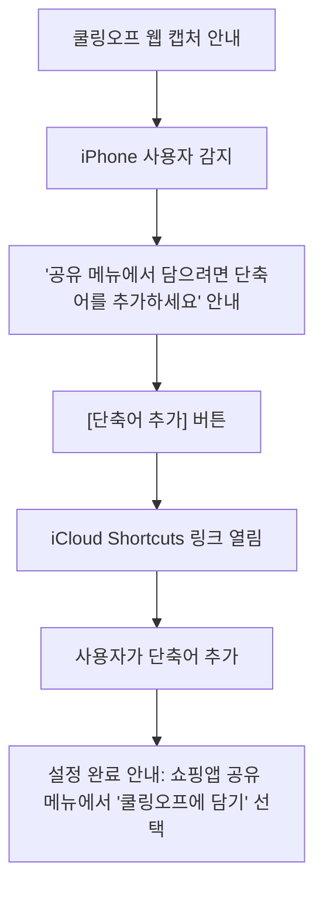
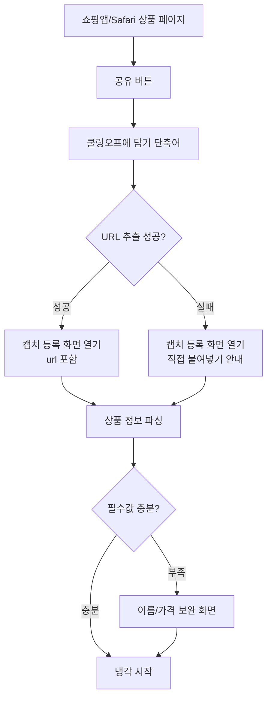
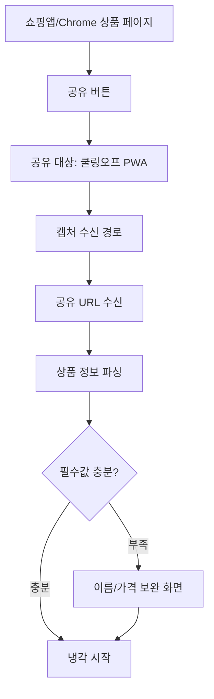
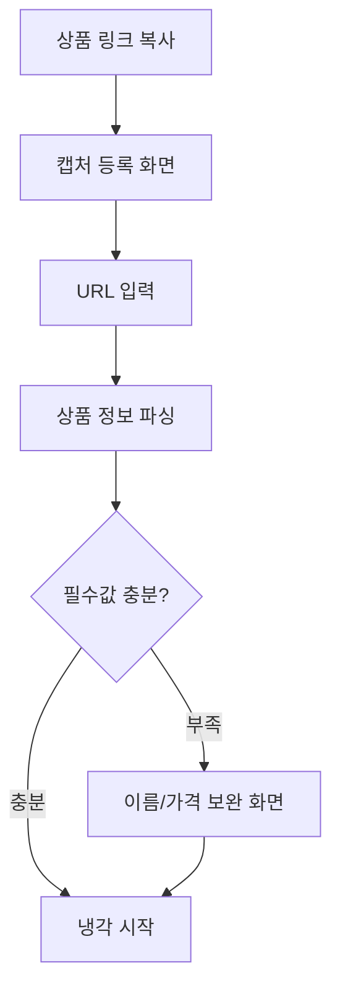

# 쿨링오프 유입·캡처 전략 PRD

> 이 문서는 사용자가 사고 싶은 물건을 어떻게 쿨링오프에 등록하게 만들지 정의한다.
> PR #109의 차단형 브라우저 확장 기획은 이 문서로 대체한다.
>
> | 관련 문서 | 경로 |
> |----------|------|
> | 본 서비스 PRD | `./prd.md` |
> | 기획 배경 | `./기획-배경.md` |
> | 알림 정책 | `./notification-policy.md` |
> | 화면 정책 | `../design/screen-spec.md` |
> | 개발 참고 메모 | `../engineering/tech-spec.md` |
> | 캡처 구현 메모 | `../engineering/capture-tech-spec.md` |
> | 대체 대상 | PR #109 (`web-ppu/cooling-off#109`) |

Status: DRAFT
Generated: 2026-05-27
Supersedes: PR #109의 구매 인터셉트형 브라우저 확장

---

## 1. 요약

쿨링오프의 첫 병목은 기능이 아니라 등록 유입이다.

사용자가 쇼핑 중에 사고 싶은 물건을 발견했을 때, 일부러 쿨링오프를 열고 상품명, 가격, URL을 입력할 가능성은 낮다. 특히 충동구매 상황에서는 더 그렇다. 그래서 이 문서의 목표는 구매를 막는 기능이 아니라, 사고 싶은 순간에 최대한 짧게 쿨링오프에 담는 입구를 만드는 것이다.

이 프로젝트는 웹프로그래밍 수업 팀플이다. 네이티브 iOS/Android 앱, 네이티브 Share Extension, 앱스토어 배포는 범위 밖이다. 네이티브 앱이 있으면 아이폰 공유시트에 가장 깔끔하게 붙을 수 있지만, 지금은 그 길을 쓰지 않는다.

대신 플랫폼별로 웹으로 연결되는 캡처 경로를 쓴다.

| 플랫폼 | 메인 캡처 경로 | 설명 |
|--------|----------------|------|
| iPhone | iOS Shortcuts 공유시트 액션 | 우리가 만든 "쿨링오프에 담기" 단축어를 배포한다. 단축어가 공유 URL을 받아 웹의 캡처 등록 흐름으로 넘긴다. |
| Android / Chromium | PWA `share_target` | 설치된 PWA가 공유 대상에 뜨고, 공유 URL을 캡처 수신 라우트로 받는다. |
| 공통 fallback | URL 붙여넣기 | 모든 환경에서 동작해야 하는 안전 경로다. |

냉각, AI 채팅, 결정, 기록은 기존 웹앱이 담당한다. 이 문서는 그 앞단, 즉 "어떻게 첫 등록까지 오게 할 것인가"만 다룬다.

---

## 2. 왜 #109를 버리나

PR #109는 쿠팡과 네이버에서 "구매하기"를 가로채고, 그 시점에 쿨링오프 등록을 제안하는 브라우저 확장 기획이었다. 방향 자체는 이해된다. 구매 욕구가 가장 뜨거운 순간에 끼어들겠다는 것이다.

문제는 오발화다. 쿠팡에서는 식품, 생활용품, 육아용품, 건강용품처럼 반복적으로 사는 상품이 많다. 휴지나 생수를 살 때마다 모달이 뜨면 사용자는 도움을 받는 게 아니라 방해받는다고 느낀다. 몇 번만 잘못 뜨면, 사용자는 모달을 반사적으로 닫거나 확장을 지운다.

또 하나의 문제는 모바일이다. 한국 쇼핑은 모바일 비중이 크다. 데스크톱 크롬 확장은 충동이 실제로 발생하는 순간을 많이 놓친다.

마지막으로 유지보수 비용이 크다. 쿠팡/네이버의 DOM을 감지해 구매 버튼을 가로채는 방식은 사이트 개편이나 A/B 테스트에 약하다.

그래서 이 문서는 방향을 바꾼다.

- 구매를 자동으로 막지 않는다.
- 사용자가 직접 부르는 캡처 경로를 만든다.
- iPhone 메인 사용자를 고려해 iOS Shortcuts를 1순위로 둔다.
- Android/Chromium에서는 PWA `share_target`을 쓴다.
- 어떤 환경에서도 URL 붙여넣기로 빠질 수 있게 한다.

---

## 3. 문제 정의

쿨링오프가 잡을 수 있는 사용자는 "아무 자각 없이 충동구매하는 사람"이 아니다. 그런 사람은 자기를 말리는 도구를 설치하거나 열지 않는다.

현실적인 타깃은 구매 후 후회를 겪어본 사람이다. "다음에는 한 번 식혀보고 싶다"는 생각이 있는 사람, 즉 문제를 조금은 자각한 사람이다. 이들에게 필요한 것은 강한 차단이 아니라, 사고 싶은 순간에 부담 없이 담을 수 있는 짧은 경로다.

캡처는 사용자가 직접 부르는 행동이어야 한다. 서비스가 먼저 끼어들어 "사지 마"라고 말하지 않는다. 이 점이 쿨링오프의 결정 중립성과 맞다.

---

## 4. 목표와 비목표

### 목표

1. 쇼핑 중 발견한 상품 URL을 쿨링오프로 쉽게 넘긴다.
2. 넘겨받은 URL에서 상품명, 가격, 이미지, 출처를 가능한 만큼 자동으로 채운다.
3. 파싱이 실패해도 사용자가 직접 보완해 등록할 수 있게 한다.
4. 등록 후 기존 가격별 냉각 기준으로 바로 냉각을 시작한다.
5. iPhone, Android/Chromium, 미지원 환경의 흐름을 문서와 UI에서 분명히 나눈다.

### 비목표

- 네이티브 iOS/Android 앱을 만들지 않는다.
- iOS 네이티브 Share Extension을 만들지 않는다.
- 앱스토어 배포를 전제로 하지 않는다.
- 구매 버튼을 자동으로 가로채지 않는다.
- 모든 플랫폼에서 같은 1탭 경험을 제공한다고 주장하지 않는다.
- 단축어 안에 사용자 토큰, API 키, 인증 로직을 넣지 않는다.

---

## 5. 최종 캡처 전략

### 5.1 iPhone: iOS Shortcuts 공유시트 액션

iPhone에서는 PWA `share_target`으로 공유 메뉴에 쿨링오프를 띄울 수 없다고 본다. WebKit의 Web Share Target 지원 이슈가 아직 열린 상태이고, 현재 수업 범위에서 해결할 수 있는 문제가 아니다.

대신 우리가 만든 iOS 단축어를 배포한다. 사용자는 한 번만 단축어를 추가하면, 이후 쇼핑 앱이나 Safari의 공유 메뉴에서 "쿨링오프에 담기"를 실행할 수 있다.

단축어는 공유된 URL을 받아서 쿨링오프 웹으로 넘긴다.

```text
쇼핑 앱/Safari에서 상품 발견
  -> 공유 버튼
  -> [쿨링오프에 담기] 단축어 선택
  -> 단축어가 공유 URL 추출
  -> https://<domain>/<capture-route>?url=<encoded-url>&source=ios-shortcut 열기
  -> 쿨링오프 웹에서 파싱/확인/등록
```

이 방식은 네이티브 앱처럼 완벽하지 않다. 사용자가 단축어를 추가해야 하고, 공유시트 안에서 보이는 위치도 iOS 정책에 따른다. 그래도 웹만으로 아이폰 공유 흐름에 들어가는 가장 현실적인 방법이다.

### 5.2 Android / Chromium: PWA `share_target`

Android Chrome이나 Chromium 계열에서는 설치된 PWA를 공유 대상에 등록할 수 있다. 이 환경에서는 PWA `share_target`을 메인 캡처 경로로 제공한다.

```text
쇼핑 앱/Chrome에서 상품 발견
  -> 공유 버튼
  -> 공유 대상에서 [쿨링오프] 선택
  -> 공유 URL이 쿨링오프 캡처 흐름으로 전달
  -> 쿨링오프 웹에서 파싱/확인/등록
```

전제는 명확히 둔다.

- PWA 설치가 필요하다.
- 지원되는 브라우저에서만 공유 대상에 뜬다.
- 공유로 들어오는 값은 신뢰하지 않고 서버에서 검증한다.

### 5.3 공통 fallback: URL 붙여넣기

모든 환경에서 URL 붙여넣기 경로를 제공한다. 단축어를 설치하지 않았거나, PWA 공유 타깃이 안 뜨거나, 공유 URL 추출이 실패해도 이 경로로 등록할 수 있어야 한다.

```text
상품 링크 복사
  -> 쿨링오프 캡처 등록 화면 진입
  -> URL 붙여넣기
  -> 쿨링오프 웹에서 파싱/확인/등록
```

fallback은 기능 축소가 아니라 안전장치다. 공유 진입이 실패해도 등록 루프가 막히면 안 된다.

---

## 6. 사용자 플로우

### 6.1 iPhone 최초 설정 플로우



UI에서 "앱 설치"라고 말하지 않는다. 실제로 설치하는 것은 앱이 아니라 단축어다. 카피는 "아이폰 공유 메뉴에 담기 버튼 추가" 정도가 적절하다.

### 6.2 iPhone 캡처 플로우



### 6.3 Android / Chromium 캡처 플로우



### 6.4 URL 붙여넣기 플로우



---

## 7. 화면 요구사항

### 7.0 수동 등록과 캡처 등록의 역할 차이

현재 서비스에는 `/register` 수동 등록 화면이 있다. 사용자가 쿨링오프에 들어와서 직접 물건을 등록할 때 쓴다.

캡처 등록은 맥락이 다르다. 사용자가 빈 폼을 채우러 온 것이 아니라, 이미 쇼핑 중 발견한 URL을 들고 들어온 상태다. 따라서 사용자 경험은 수동 등록과 달라야 한다.

| 화면 | 진입 맥락 | 사용자가 처음 해야 하는 일 | 주된 처리 |
|------|-----------|----------------------------|-----------|
| `/register` | 사용자가 직접 등록하러 들어옴 | 이름, 가격, URL, 이유 입력 | 수동 등록 |
| 캡처 등록 화면 | 공유/단축어/URL 붙여넣기로 들어옴 | URL 확인 또는 붙여넣기 | URL 파싱, 자동 채움, 부족한 값만 보완 |
| 공유 수신 지점 | PWA 공유 대상에서 호출됨 | 사용자가 직접 보지 않을 수 있음 | 공유된 URL을 캡처 등록 흐름으로 연결 |

기획에서 고정하는 것은 라우트명이 아니라 사용자 흐름이다. 개발자는 별도 `/capture` 화면을 만들거나, 기존 `/register`를 캡처 모드로 확장하는 방식 중 하나를 선택할 수 있다. 단, 사용자 입장에서는 "URL을 먼저 받아 자동 파싱하고, 부족한 값만 보완해 냉각을 시작하는 흐름"이어야 한다.

정리하면:

- 재사용 가능: 기존 등록 저장 로직, 가격별 냉각 기준, 검증 규칙, 공통 입력 컴포넌트 일부
- 개발자 선택: 별도 `/capture` 라우트, `/register`의 capture mode, 공통 폼 컴포넌트 분리
- 기획상 필수: 캡처 진입 사용자가 처음부터 빈 수동 등록 폼을 마주하지 않게 할 것

이 문서에서는 설명 편의상 이 흐름을 `/capture`라고 부른다. 최종 저장은 기존 등록과 같은 데이터 모델로 들어간다.

### 7.1 캡처 등록 화면

URL 붙여넣기와 모든 fallback의 기본 화면이다. 별도 `/capture` 라우트로 만들 수도 있고, `/register`의 capture mode로 구현할 수도 있다.

필수 요소:

- URL 입력 필드
- [상품 정보 가져오기] 버튼
- 파싱 중 상태
- 파싱 실패 상태
- 이름/가격 보완 입력
- [냉각 시작] 버튼

동작:

- `?url=` 쿼리가 있으면 진입 즉시 해당 URL을 입력값으로 채운다.
- URL이 유효하면 상품 정보 파싱을 시도한다.
- 이름과 가격이 확보되면 짧은 확인 화면을 보여준다.
- 가격이 없으면 사용자가 직접 입력해야 한다.
- 이름이 없으면 페이지 title 또는 URL host를 임시 후보로 보여줄 수 있다.

### 7.2 캡처 상태 디자인

캡처 등록은 기존 수동 등록 화면과 다른 상태가 필요하다. 최소한 아래 상태는 화면 설계에 포함한다.

| 상태 | 필요한 UI |
|------|-----------|
| URL이 이미 들어온 상태 | "이 링크를 가져왔어요" 맥락 표시, 원본 URL 확인 |
| 파싱 중 | 상품 정보를 가져오는 로딩 상태 |
| 파싱 성공 | 자동으로 채운 상품명/가격/이미지 확인 |
| 일부 파싱 실패 | 예: 이름은 채웠고 가격만 입력 요청 |
| 전체 파싱 실패 | URL은 유지하고 수동 입력으로 전환 |
| iOS 단축어 진입 | "단축어로 받은 링크" 정도의 짧은 맥락 표시 |
| PWA 공유 진입 | "공유로 받은 링크" 정도의 짧은 맥락 표시 |
| 중복 URL 가능성 | 이미 담은 링크일 수 있음을 안내하고 계속/취소 선택 |

이 상태 디자인이 필요한 이유는 간단하다. 사용자는 이미 공유 행동을 했기 때문에, 빈 등록 폼을 보면 "왜 또 처음부터 입력하지?"라고 느낄 수 있다.

### 7.3 PWA 공유 수신 지점

Android/Chromium에서 공유 대상 [쿨링오프]를 눌렀을 때 거치는 연결 지점이다. 사용자가 직접 오래 머무는 화면이라기보다, 공유된 URL을 캡처 등록 화면으로 넘기는 역할에 가깝다.

역할:

- 공유된 URL을 받는다.
- URL 후보를 정리한다.
- 캡처 등록 화면으로 넘긴다.
- URL을 찾지 못하면 직접 붙여넣기 안내로 보낸다.

### 7.4 iPhone 단축어 설치 안내 화면

역할:

- iPhone 사용자에게 단축어를 추가하는 이유와 사용법을 안내한다.
- iCloud Shortcuts 링크로 이동시킨다.
- 단축어 추가 후 사용법을 짧게 보여준다.

노출 시점:

- 첫 진입부터 설치를 강요하지 않는다.
- 캡처 등록 화면에서 iPhone 사용자에게 안내한다.
- 첫 수동 등록 또는 첫 캡처 등록이 끝난 뒤 "다음부터 더 빠르게 담기" 카드로 한 번 더 안내한다.
- About에는 상시 진입점을 둔다.

카피 방향:

- "아이폰 공유 메뉴에 쿨링오프 담기 버튼을 추가하세요."
- "앱 설치 없이 단축어로 연결합니다."
- "공유 버튼을 누른 뒤 [쿨링오프에 담기]를 선택하면 등록 화면으로 이동합니다."

피해야 할 표현:

- "앱을 설치하세요" (실제 앱이 아님)
- "자동으로 충동구매를 막아드려요" (차단형 기능 아님)

---

## 8. 등록 데이터 정책

캡처로 들어온 상품도 기존 수동 등록과 같은 항목으로 저장한다. 사용자는 어디서 등록했는지에 따라 다른 냉각 경험을 겪으면 안 된다.

등록에 필요한 값:

| 값 | 정책 |
|----|------|
| 상품명 | 파싱 성공 시 자동 입력, 실패 시 사용자 입력 |
| 가격 | 파싱 성공 시 자동 입력, 실패 시 사용자 입력 |
| 상품 URL | 공유/붙여넣기로 받은 원본 URL 저장 |
| 사고 싶은 이유 | 선택값. 비워도 등록 가능 |
| 냉각 기간 | 기존 가격별 냉각 기준으로 계산 |

사고 싶은 이유는 캡처 단계에서 강제하지 않는다. 캡처 순간에는 속도가 중요하다. 대신 냉각 종료 후 AI 채팅이 이유를 묻는다. 단, 확인 화면을 두는 경우에는 "왜 사고 싶어요?" 한 줄 입력을 선택값으로 둘 수 있다.

URL 파싱 결과는 신뢰하지 않는다. 사용자에게 보여주고, 필요한 경우 수정할 수 있어야 한다.

### 8.1 중복 URL 정책

MVP에서는 같은 URL을 hard block하지 않는다. 같은 상품이라도 시간이 지나 다시 고민할 수 있고, 옵션이나 가격이 바뀌었을 수 있기 때문이다.

대신 같은 사용자 계정에 같은 URL의 미삭제 항목이 있으면 soft warning을 보여준다.

```text
이미 담은 적 있는 링크예요.
[기존 항목 보기] [새로 담기]
```

기본 선택은 기존 항목 보기다. 사용자가 명시적으로 선택하면 새로 담을 수 있다.

---

## 9. 기술 경계

이 PRD는 구현 방식을 세세하게 고정하지 않는다. 다만 제품 판단에 영향을 주는 기술 경계는 명시한다.

- iPhone은 네이티브 앱이 없으므로 iOS Shortcuts로 공유 URL을 웹에 넘긴다.
- Android/Chromium은 PWA `share_target`을 쓴다.
- 단축어에는 API key, 사용자 토큰, Supabase 정보 등을 넣지 않는다.
- URL 파싱은 쿠팡, 네이버쇼핑, 무신사 같은 지원 쇼핑몰부터 시작한다.
- 지원 쇼핑몰 밖 URL은 서버에서 자동으로 가져오지 않고, URL 저장과 수동 입력으로 처리한다.
- URL 파싱 결과는 사용자에게 확인받는다.

구체적인 PWA 설정, 단축어 구성, URL 파싱 보안 기준은 [`../engineering/capture-tech-spec.md`](../engineering/capture-tech-spec.md)에 둔다.

---

## 10. 등록 깊이

MVP는 **짧은 확인 후 냉각 시작**으로 간다. 캡처 순간의 속도는 중요하지만, 가격은 냉각 기간을 결정하므로 사용자가 한 번 확인해야 한다.

| 방식 | 흐름 | 장점 | 단점 |
|------|------|------|------|
| A. 바로 등록 | 공유/URL 입력 -> 파싱 성공 -> 냉각 시작 | 가장 빠르다 | 이름/가격이 틀렸을 때 수정 기회가 적다 |
| B. 짧은 확인 | 자동 입력된 폼 확인 -> 냉각 시작 | 데이터 정확도가 높다 | 탭이 1회 늘어난다 |

최종 결정은 B다.

확인 화면 기준:

- 이름과 가격이 모두 있으면 확인 화면을 짧게 보여주고 [냉각 시작]을 누르게 한다.
- 가격이 없으면 반드시 입력받는다.
- 이유 입력은 선택으로 둔다.
- 확인 화면은 길게 만들지 않는다. 상품명, 가격, URL, 선택 이유 입력, [냉각 시작]만 둔다.

---

## 11. 온보딩

캡처 기능은 설명 없이 쓰기 어렵다. 특히 iPhone 단축어는 사용자가 한 번 설치해야 하므로 온보딩이 필요하다.

진입점:

- 캡처 등록 화면: iPhone은 단축어, Android/Chromium은 PWA 설치 안내
- About
- 첫 등록 완료 후 "다음부터 더 빠르게 담기" 안내

플랫폼별 안내:

| 조건 | 안내 |
|------|------|
| iPhone | 단축어 추가 안내 |
| Android/Chromium | PWA 설치 + 공유 대상 안내 |
| 데스크톱/미지원 | URL 붙여넣기 안내 |

처음부터 모든 안내를 한 화면에 몰아넣지 않는다. 기기와 브라우저를 감지해 해당 사용자에게 필요한 안내만 보여준다.

설치/단축어 안내는 첫 방문 강요가 아니라 맥락형 안내로 둔다. 사용자가 상품을 담으려 하거나, 첫 등록을 끝낸 뒤에 보여주는 편이 낫다.

---

## 12. 성공 기준

MVP 성공 기준:

- iPhone에서 단축어를 통해 공유 URL이 캡처 등록 흐름으로 들어온다.
- Android/Chromium에서 설치된 PWA가 공유 대상에 뜬다.
- URL 붙여넣기 fallback으로도 같은 등록 플로우를 탈 수 있다.
- 쿠팡/네이버/무신사 중 최소 2개에서 이름 또는 이미지 파싱이 동작한다.
- 가격 파싱 실패 시 사용자가 직접 입력해 냉각을 시작할 수 있다.
- 캡처로 등록한 항목이 기존 홈/냉각/AI채팅/기록 흐름과 연결된다.
- 같은 URL을 다시 담을 때 soft warning이 노출된다.
- 지원 쇼핑몰 밖 URL은 자동으로 가져오지 않고 수동 입력으로 전환된다.

측정 지표:

- 캡처 진입 수
- 캡처 진입 -> 냉각 시작 전환율
- 파싱 성공률(이름/가격/이미지 분리)
- 수동 보완 발생률
- 단축어 설치 안내 클릭 수
- PWA 설치 안내 클릭 수
- 중복 URL warning 노출 후 새로 담기 비율
- 지원 쇼핑몰 밖 URL 비율
- 가격 수동 입력 비율

---

## 13. 하지 않을 것

- 네이티브 iOS/Android 앱을 만들지 않는다.
- 네이티브 Share Extension을 만들지 않는다.
- 구매 버튼을 자동으로 가로채지 않는다.
- 모든 상품 구매에 모달을 띄우지 않는다.
- 단축어 안에서 직접 DB에 등록하지 않는다.
- 단축어 안에 사용자 인증 정보를 저장하지 않는다.
- 스크린샷 OCR, 홈 위젯, 고급 단축어 자동화는 MVP에 넣지 않는다.
- "절약한 금액"이나 "잘 참았다" 같은 보상형 메시지를 쓰지 않는다.
- 지원 쇼핑몰 밖 URL을 서버에서 무작정 가져오지 않는다.

---

## 14. 확정 결정

1. iPhone은 iOS Shortcuts를 메인 캡처 경로로 둔다.
2. Android/Chromium은 PWA `share_target`을 캡처 경로로 둔다.
3. URL 붙여넣기는 모든 환경의 fallback으로 유지한다.
4. 단축어/PWA 설치 안내는 첫 방문 강요가 아니라 캡처 맥락과 첫 등록 후 안내로 둔다.
5. 캡처 후에는 짧은 확인 화면을 보여주고 냉각을 시작한다.
6. 사고 싶은 이유 입력은 선택으로 둔다.
7. 같은 URL은 hard block하지 않고 soft warning을 보여준다.
8. 자동 URL 파싱은 지원 쇼핑몰부터 시작한다.
9. 지원 쇼핑몰 밖 URL은 자동으로 가져오지 않고 수동 입력으로 전환한다.
10. 서버가 외부 URL을 열 때는 내부망 접근 차단 같은 보안 검증을 필수로 한다.

---

## 15. Sources

- Apple Shortcuts 공유: https://support.apple.com/guide/shortcuts/share-shortcuts-apdf01f8c054/ios
- Apple Shortcuts Share Sheet 입력: https://support.apple.com/guide/shortcuts/apd7644168e1/ios
- Apple Shortcuts URL 열기: https://support.apple.com/guide/shortcuts/apdaf74d75a5/ios
- Web Share Target API (MDN): https://developer.mozilla.org/en-US/docs/Web/Progressive_web_apps/Manifest/Reference/share_target
- Web Share Target API (Chrome Developers): https://developer.chrome.com/docs/capabilities/web-apis/web-share-target
- WebKit Web Share Target 이슈: https://bugs.webkit.org/show_bug.cgi?id=194593
- PWA 설치 UX (web.dev): https://web.dev/learn/pwa/installation-prompt
- 폴센트: https://fallcent.com/
- JITAI(구매 시점 개입): https://pmc.ncbi.nlm.nih.gov/articles/PMC5364076/
- 변화단계모델 / 소비 자기통제(Lawson 2001): https://onlinelibrary.wiley.com/doi/10.1002/mar.1010
- 한국 이커머스 모바일 비중(PCMI 2024): https://paymentscmi.com/insights/south-korea-2025-payments-ecommerce-trends/
- Icebox 사례: https://thenextweb.com/news/chrome-extension-stops-impulse-purchases-forcing-think
