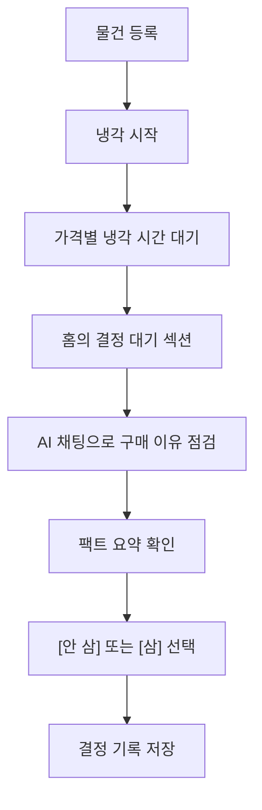
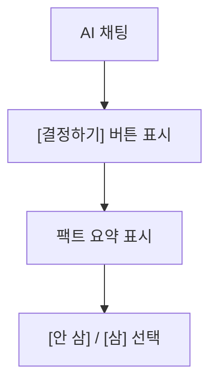

# 쿨링오프 PRD

> 이 문서는 쿨링오프의 기준 제품 문서입니다.
> 제품 목표, 사용자, 핵심 흐름, 기능 범위, 성공 기준을 정의합니다.
>
> | 관련 문서 | 경로 |
> |----------|------|
> | 기획 배경 | `./기획-배경.md` |
> | 화면 정책 | `../design/screen-spec.md` |
> | 개발 참고 메모 | `../engineering/tech-spec.md` |
> | AI 프롬프트 | `../engineering/ai-prompt-v1.md` |

---

## 1. 제품 요약

쿨링오프는 충동구매가 바로 결제로 이어지지 않게 막고, 사용자가 스스로 합리화한 구매 이유를 시간과 AI 채팅을 통해 다시 점검하도록 돕는 반응형 웹 서비스입니다.

특히 "실용적이다", "오래 쓸 것이다", "나에게 필요한 투자다"처럼 소비를 합리화하는 사용자가 구매 전 한 번 더 객관적으로 판단할 수 있게 만드는 것을 목표로 합니다.

핵심 목적은 무조건 사지 못하게 하는 것이 아니라, 충동과 합리화를 구분한 뒤 사용자가 직접 [삼] 또는 [안 삼]을 선택하게 만드는 것입니다.

---

## 2. 타겟 사용자

### Primary: 합리화형 충동구매자

사고 싶은 마음을 "실용적이다", "오래 쓸 것이다", "나에게 필요한 투자다"처럼 합리적인 이유로 설명하는 사용자입니다.

- 생산성 도구, 전자기기, 자기계발 소비에 약합니다.
- 구매 전에는 필요하다고 느끼지만, 시간이 지난 뒤 충동이었다고 인정할 수 있습니다.
- 결정을 완전히 막기보다, 한 번 더 객관적으로 확인하는 장치를 원합니다.

### 타겟이 아닌 사용자

| 유형 | 제외 이유 |
|------|----------|
| 과시형 소비 | 충동을 문제로 인식하지 않을 가능성이 높습니다. |
| 수집/덕질 소비 | 실용성 판단보다 취향과 수집 욕구가 중심입니다. |
| 생활비 습관 소비 | 배달, 카페, 편의점처럼 반복적으로 쓰는 소비는 특정 물건을 등록하고 기다렸다가 결정하는 구조와 맞지 않습니다. |
| 쇼핑중독 | 임상적 치료가 필요한 영역입니다. |

---

## 3. 제품 원칙

1. **사전 확인**: 구매 후 취소가 아니라, 구매 전에 판단 시간을 둡니다.
2. **구매는 능동 선택**: 사용자가 [삼]을 선택하기 전까지 구매 결정으로 보지 않습니다.
3. **결정 중립성**: [안 삼]과 [삼]을 동일한 비중으로 보여주며 어느 쪽도 정답처럼 유도하지 않습니다.
4. **외재 보상 금지**: 절약 금액, 스트릭, 배지처럼 "안 사는 것"을 게임화하지 않습니다.
5. **짧은 등록**: 이름, 가격, URL, 사고 싶은 이유만 입력합니다.
6. **냉각기 중 자극 최소화**: 냉각 중에는 항목 구분에 필요한 이름, 남은 시간, 결정 가능 시점만 보여주고, 구매 욕구를 다시 키울 수 있는 상세 정보는 숨깁니다.
7. **AI는 현재 사실을 되짚는 역할**: AI는 현재 등록 정보와 현재 대화에서 나온 사실만 사용합니다.
8. **톤 분리**: AI 채팅만 짧고 직설적인 반말을 사용합니다. 시스템 UI, 오류, 저장, 로그인 안내는 중립적인 존댓말을 사용합니다.

---

## 4. 핵심 흐름

### 가격별 냉각기

| 가격 | 냉각 기간 |
|------|:---:|
| 5만원 이하 | 1일 |
| 5만원 초과~10만원 이하 | 2일 |
| 10만원 초과~30만원 이하 | 7일 |
| 30만원 초과~100만원 이하 | 14일 |
| 100만원 초과 | 30일 |

---

## 5. 기능 요구사항

MVP 기능은 사용자가 로그인한 뒤 물건을 등록하고, 가격별 냉각 기간이 끝난 뒤 AI 채팅으로 구매 이유를 다시 점검하고 직접 결정하는 흐름을 기준으로 합니다.

### FR-1. 로그인 및 데이터 저장

MVP부터 사용자 데이터는 계정에 연결된 영구 저장소에 저장합니다.

- MVP는 최소 로그인 방식 1개를 제공합니다.
- 비로그인 사용자는 About 확인과 로그인 진입만 가능합니다.
- 실제 등록, 냉각, AI 채팅, 기록 열람은 로그인 후 가능합니다.
- 등록 물건, 결정 결과, AI 채팅 기록은 계정 기준으로 저장합니다.
- 사용자별 데이터는 분리되어야 합니다.
- 사용자 데이터는 브라우저가 아니라 계정 기준 저장소에 저장합니다.

### FR-2. 물건 등록

사용자는 단일 폼에서 사고 싶은 물건을 등록합니다.

| 필드 | 필수 여부 | 설명 |
|------|:---:|------|
| 이름 | 필수 | 물건 이름 |
| 가격 | 필수 | 냉각 기간 산정 기준 |
| URL | 선택 | 결정 시점에 다시 확인할 수 있는 링크 |
| 사고 싶은 이유 | 선택 | AI 채팅의 출발점이 되는 사용자 설명 |

- 이름과 가격이 유효할 때만 [냉각 시작]을 누를 수 있습니다.
- URL 오류는 등록을 막지 않습니다. 다만 링크로 열 수 있는 값으로 취급하지 않습니다.
- 등록이 완료되면 냉각 시작 안내 후 홈으로 이동합니다.
- 상세 입력 검증 기준은 화면 정책 문서에서 관리합니다.

### FR-3. 냉각기

등록된 물건은 가격에 따라 자동으로 냉각 기간이 배정됩니다.

- 냉각 중에는 항목 이름, 남은 시간, 결정 가능 시점만 표시합니다.
- 냉각 중에는 가격, URL, 사고 싶은 이유, 이미지를 표시하지 않습니다.
- 냉각 중 항목은 사용자가 삭제할 수 있습니다. 삭제한 항목은 홈과 기록에 남기지 않습니다.
- 냉각기가 끝난 항목은 홈의 결정 대기 섹션에 표시합니다.
- 결정 대기 항목은 사용자가 [삼] 또는 [안 삼]을 선택할 때까지 유지합니다.
- 결정 대기 항목도 사용자가 삭제할 수 있습니다. 삭제한 항목은 홈과 기록에 남기지 않습니다.

### FR-4. 홈

홈은 사용자가 현재 기다려야 할 항목과 결정해야 할 항목을 확인하는 화면입니다.

- 결정 대기 섹션을 냉각 중 섹션보다 먼저 표시합니다.
- 냉각 중 항목에는 항목 이름, 남은 시간, 결정 가능 시점만 표시합니다.
- 등록한 항목이 없으면 "사고 싶은 물건이 있나요?"를 표시합니다.
- 로그인 상태에서만 등록 버튼과 기록 진입을 제공합니다.
- 냉각 중 항목을 선택하면 냉각 중 화면으로 이동합니다.
- 결정 대기 항목을 선택하면 AI 채팅 화면으로 이동합니다.

### FR-5. AI 채팅

냉각기가 끝난 물건을 선택하면 AI 채팅과 결정이 같은 화면에서 진행됩니다.

- 첫 AI 메시지는 항상 "네 말 들어볼게. 지금 이거 왜 사고 싶어?"로 시작합니다.
- AI가 사용자의 답변을 바탕으로 구체 질문, 체감 비용 계산, 모순 확인 등 새로운 관점을 제시하면 [결정하기] 버튼을 표시합니다.
- [결정하기] 버튼이 표시된 뒤에도 사용자는 대화를 계속할 수 있습니다.
- 최대 10턴에 도달하면 AI가 현재 대화 범위 안에서 마무리하고 추가 입력을 비활성화합니다.
- [결정하기]를 누르면 대화에서 나온 사실만 정리한 팩트 요약을 보여줍니다.
- 팩트 요약은 판단, 조언, 결론을 포함하지 않습니다.

### FR-6. 결정

사용자는 [안 삼] 또는 [삼] 중 하나를 선택합니다.

- 두 버튼은 동일한 시각 비중으로 표시합니다.
- 선택 즉시 결정으로 확정하고 기록에 저장합니다.
- 완료된 결정 기록은 사용자가 삭제할 수 있습니다. 삭제하면 해당 기록, 당시 대화, 팩트 요약을 더 이상 표시하지 않습니다.
- "포기", "구매 성공", "잘 참았다" 같은 편향된 표현은 사용하지 않습니다.

### FR-7. 기록

기록은 사용자가 이미 내린 결정을 다시 확인하는 화면입니다.

- [삼] 또는 [안 삼]으로 확정한 항목만 표시합니다.
- 기록은 월별로 묶어 보여줍니다.
- 상단에는 [삼]과 [안 삼]을 합산한 결정 개수만 표시합니다.
- 각 기록에서는 당시 AI 채팅을 다시 볼 수 있습니다.
- 팩트 요약이 있었던 결정은 요약도 함께 표시합니다.
- 냉각 중 삭제한 항목과 결정 대기 항목은 기록에 포함하지 않습니다.
- 사용자가 삭제한 완료 기록은 기록 목록과 결정 개수에서 제외합니다.
- MVP에서는 기록 필터와 검색을 제공하지 않습니다.

### FR-8. 알림

냉각기가 끝났음을 알려 사용자가 다시 판단하러 돌아오게 합니다.

- 알림은 사용자가 다시 서비스에 들어오도록 돕는 편의 기능입니다.
- 사용자가 서비스에 들어오면 홈에서 남은 시간 또는 결정 대기 상태를 확인할 수 있습니다.
- 알림 제공 방식은 개발 단계에서 확정합니다.

### FR-9. About

About은 서비스의 목적과 주의사항을 설명하는 정적 페이지입니다.

- 사고 싶은 마음과 실제 만족의 차이
- 구매 전 냉각기의 의미
- AI 채팅의 역할
- 데이터 저장과 계정 정책
- 쇼핑중독 치료 도구가 아니라는 안내

---

## 6. AI 채팅 기준

AI는 사용자가 스스로 판단할 수 있도록 현재 대화의 사실을 다시 비춰주는 역할을 합니다.

### AI가 하는 일

- 추상적인 이유를 실제 빈도, 상황, 숫자로 좁혀 묻습니다.
- 등록할 때의 이유와 대화 중 설명이 달라지면 짚어줍니다.
- 가격, 사용 빈도, 유지비 등 사용자가 말한 숫자를 체감 비용으로 계산해 보여줍니다.
- 충분한 관점이 제시되면 사용자가 결정으로 넘어갈 수 있게 합니다.

### AI가 하지 않는 일

- 사거나 사지 말라고 지시하지 않습니다.
- 도덕 평가를 하지 않습니다.
- 과도하게 공감하거나 칭찬하지 않습니다.
- 현재 등록 정보와 현재 대화에 없는 사실을 만들지 않습니다.
- MVP에서는 사용자의 과거 결정 기록을 AI 채팅의 근거로 사용하지 않습니다.

---

## 7. 성공 기준

### 사용자 성과

- 냉각기 후 [안 삼] 선택률 30% 이상
- "이 서비스 덕분에 더 합리적으로 결정했다"는 주관 응답 70% 이상

### 제품 성과

- 등록 후 냉각기 완료까지 도달률 50% 이상
- 7일 리텐션 20% 이상

### 학술 성과

- 핵심 루프를 시연 가능한 수준으로 완성합니다.
- 주요 제품 결정의 근거를 문서화합니다.

### 측정하지 않는 지표

- DAU와 세션 길이 증대
- [안 삼] 횟수 최대화
- 절약 금액 합산
- 스트릭과 배지

---

## 8. MVP 범위

### MVP 포함

- 로그인 기반 영구 저장
- 물건 등록
- 가격별 냉각기
- 홈의 냉각 중/결정 대기 표시
- AI 채팅 기반 결정
- 팩트 요약
- [안 삼]/[삼] 결정
- 기록 월별 묶음
- 대화 다시 보기
- 냉각기 만료 알림
- About

### Phase 2 후보

- 실제 AI 연결과 품질 검증
- 시나리오별 프롬프트 개선
- 홈 화면 배지 등 보조 알림
- 계정 설정, 탈퇴, 데이터 삭제
- 공유시트, 북마클릿, OCR
- URL 기반 물건 이름/가격 자동 입력
- 친구 공유, 결정 기록 공유, 익명 카운터
- 키보드 탐색, 화면 읽기, 모션 줄이기

### 만들지 않는 것

- 절약 금액 누적
- [안 삼] 비율 또는 스트릭
- 예산 잔액 추적
- 쇼핑앱 실행 차단
- 벌금형 장치
- 게이미피케이션
- 쇼핑중독 치료 기능
- 상품 이미지 업로드 또는 자동 추출

---

## 9. 리스크와 대응

| 리스크 | 영향 | 대응 |
|--------|------|------|
| 로그인 장벽 | 등록 전 이탈 가능 | 로그인 방식 1개로 최소화하고 About에서 목적을 설명합니다. |
| 데이터 분리 오류 | 다른 사용자 기록이 보일 수 있음 | 사용자별 데이터 분리를 출시 전 확인합니다. |
| AI 채팅 품질 부족 | 결정 경험이 약해짐 | 현재 대화에서 나온 사실, 구체 질문, 체감 비용 계산 중심으로 개선합니다. |
| AI의 사실 생성 | 신뢰 하락 | 현재 등록 정보와 현재 대화 밖의 사실을 사용하지 않도록 제한합니다. |
| 냉각 시간 건너뛰기 | 사용자가 정해진 대기 시간을 지나치지 않고 결정하려 할 수 있음 | 냉각 시간이 끝난 항목만 결정할 수 있도록 검증합니다. |
| [안 삼] 목적화 | 필요한 구매까지 억제할 수 있음 | 절약 금액, 비율, 스트릭을 보여주지 않고 버튼을 대칭으로 유지합니다. |
| 쇼핑중독자 오용 | 서비스가 치료 도구로 오인될 수 있음 | About에서 치료 목적이 아님을 명시합니다. |

---

## 10. 열린 질문

- 냉각 기간이 실제로 충분한 판단 시간을 제공하는가?
- 실제 AI 연결 후 응답 품질을 어떤 기준으로 검증할 것인가?
- 현재 등록 정보와 현재 대화만으로 충분한 반박 깊이를 만들 수 있는가?
- 같은 URL이나 유사 물건을 반복 등록하는 상황을 어떻게 다룰 것인가?
- v2에서 과거 결정 기록 활용·유사 물건 감지 같은 다단계 워크플로우가 들어올 시점에 LangGraph 백엔드 추가를 재평가한다. (관련: [`../archive/adr-vercel-ai-sdk.md`](../archive/adr-vercel-ai-sdk.md) §7)
